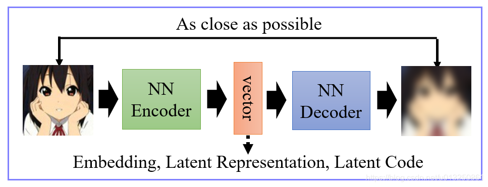
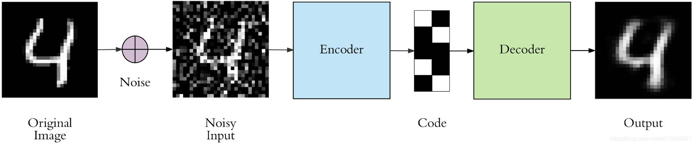

# 一、简介


自编码器是一种**无监督学习**的神经网络模型，核心目标是学习输入数据的紧凑特征表示（编码），并通过该编码重构出与输入尽可能相似的输出。它本质上是一种数据压缩与重构的工具，广泛应用于降维、去噪、特征提取、生成式建模等场景。

作为一种无监督或者自监督算法，自编码器本质上是一种数据压缩算法。

从现有情况来看，无监督学习很有可能是一把决定深度学习未来发展方向的钥匙，在缺乏**高质量标注数据**的监督机器学习时代，若是能在无监督学习方向上有所突破对于未来深度学习的发展意义重大。







## 1. 核心结构

自编码器由两部分组成，呈对称结构：

- **编码器（Encoder）**

  将高维输入数据（如 28×28 的 MNIST 图像，展平为 784 维）映射到低维隐空间（Latent Space），得到紧凑的特征编码（Latent Code）。

  数学表示：$z = f_{enc}(x) = \sigma(W_1x + b_1)$，其中$z$是编码，$\sigma$为激活函数（如 ReLU）。

- **解码器（Decoder）**

  将低维编码$z$映射回与输入维度相同的输出空间，重构输入数据。

  数学表示：$\hat{x} = f_{dec}(z) = \sigma(W_2z + b_2)$，其中$\hat{x}$是重构输出。


## 2. 核心原理

训练时通过最小化**重构损失**（如均方误差 MSE），让模型学习数据的核心特征：$$\mathcal{L}(x, \hat{x}) = \frac{1}{N}\sum_{i=1}^N \|x_i - \hat{x}_i\|^2$$ 

模型不会复制输入，而是学习数据的通用模式（如 MNIST 数字的轮廓、笔画特征），因此隐空间的编码是输入的 “本质特征”。


## 3. 常见变体

- 基础 AE：如上所述，简单的全连接层结构，适合低维数据。
- 卷积自编码器（CAE）：用卷积层替代全连接层，适合图像数据。
- 去噪自编码器（DAE）：输入加噪声，解码器重构原始无噪声数据，增强特征鲁棒性。
- 变分自编码器（VAE）：引入概率分布，让隐空间编码满足连续分布，可用于生成新数据。


# 二、代码实现


```python
import torch
import torch.nn as nn
import torch.optim as optim
from torchvision import datasets, transforms
from torch.utils.data import DataLoader
import matplotlib.pyplot as plt
import numpy as np

# ---------------------- 1. 配置超参数 ----------------------
DEVICE = torch.device("cuda" if torch.cuda.is_available() else "cpu")
BATCH_SIZE = 128
EPOCHS = 10
LEARNING_RATE = 1e-3
LATENT_DIM = 32  # 隐空间维度（编码维度），可调整
INPUT_DIM = 784  # MNIST图像展平后维度（28×28）

# ---------------------- 2. 数据预处理与加载 ----------------------
# 数据变换：转为张量 + 归一化
transform = transforms.Compose([
    transforms.ToTensor(),
    transforms.Normalize((0.1307,), (0.3081,))  # MNIST均值和标准差
])

# 加载MNIST数据集
train_dataset = datasets.MNIST(
    root='./data', train=True, download=True, transform=transform
)
test_dataset = datasets.MNIST(
    root='./data', train=False, download=True, transform=transform
)

train_loader = DataLoader(train_dataset, batch_size=BATCH_SIZE, shuffle=True)
test_loader = DataLoader(test_dataset, batch_size=BATCH_SIZE, shuffle=False)

# ---------------------- 3. 定义自编码器模型 ----------------------
class Autoencoder(nn.Module):
    def __init__(self, input_dim, latent_dim):
        super(Autoencoder, self).__init__()
        # 编码器：输入784 → 隐藏层256 → 隐藏层128 → 编码32
        self.encoder = nn.Sequential(
            nn.Linear(input_dim, 256),
            nn.ReLU(),
            nn.Linear(256, 128),
            nn.ReLU(),
            nn.Linear(128, latent_dim)
        )
        # 解码器：编码32 → 隐藏层128 → 隐藏层256 → 输出784
        self.decoder = nn.Sequential(
            nn.Linear(latent_dim, 128),
            nn.ReLU(),
            nn.Linear(128, 256),
            nn.ReLU(),
            nn.Linear(256, input_dim),
            nn.Sigmoid()  # 输出归一化到0-1（匹配图像像素范围）
        )

    def forward(self, x):
        # 前向传播：编码 → 解码
        z = self.encoder(x)  # 得到编码z
        x_recon = self.decoder(z)  # 重构输出
        return x_recon, z

# 初始化模型、损失函数、优化器
model = Autoencoder(INPUT_DIM, LATENT_DIM).to(DEVICE)
criterion = nn.MSELoss()  # 重构损失用MSE
optimizer = optim.Adam(model.parameters(), lr=LEARNING_RATE)

# ---------------------- 4. 定义训练函数 ----------------------
def train(model, loader, criterion, optimizer, epoch):
    model.train()
    total_loss = 0.0
    for batch_idx, (data, _) in enumerate(loader):
        # 数据预处理：展平图像（[batch, 1, 28, 28] → [batch, 784]）
        data = data.view(-1, INPUT_DIM).to(DEVICE)
        
        # 前向传播
        recon_batch, _ = model(data)
        loss = criterion(recon_batch, data)  # 重构损失：输出 vs 输入
        
        # 反向传播 + 优化
        optimizer.zero_grad()
        loss.backward()
        optimizer.step()
        
        total_loss += loss.item() * data.size(0)  # 累计损失
    
    avg_loss = total_loss / len(loader.dataset)
    print(f'Epoch [{epoch+1}/{EPOCHS}], Train Loss: {avg_loss:.6f}')

# ---------------------- 5. 训练模型 ----------------------
for epoch in range(EPOCHS):
    train(model, train_loader, criterion, optimizer, epoch)

# ---------------------- 6. 可视化重构结果 ----------------------
def plot_reconstruction(model, loader, num_samples=8):
    model.eval()  # 评估模式
    with torch.no_grad():  # 禁用梯度计算
        # 取一批测试数据
        data, _ = next(iter(loader))
        data = data.view(-1, INPUT_DIM).to(DEVICE)
        recon_batch, _ = model(data)
        
        # 转回CPU并可视化
        data = data.cpu().numpy()
        recon_batch = recon_batch.cpu().numpy()
        
        # 绘制原始图像和重构图像
        fig, axes = plt.subplots(2, num_samples, figsize=(15, 4))
        for i in range(num_samples):
            # 原始图像
            axes[0, i].imshow(data[i].reshape(28, 28), cmap='gray')
            axes[0, i].axis('off')
            # 重构图像
            axes[1, i].imshow(recon_batch[i].reshape(28, 28), cmap='gray')
            axes[1, i].axis('off')
        
        axes[0, 0].set_title('Original Images')
        axes[1, 0].set_title('Reconstructed Images')
        plt.tight_layout()
        plt.show()

# 调用可视化函数
plot_reconstruction(model, test_loader)
```

