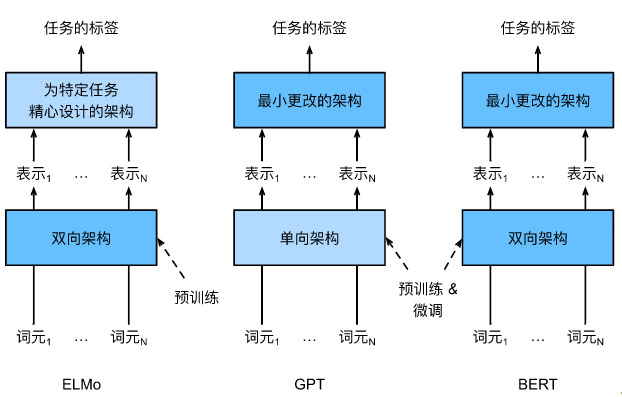
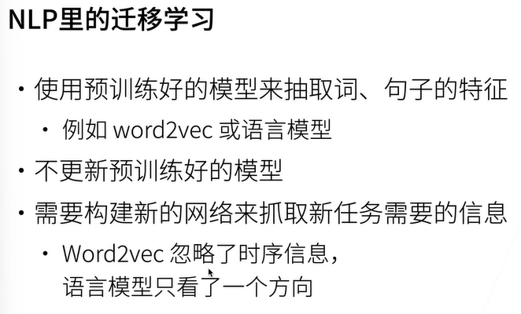
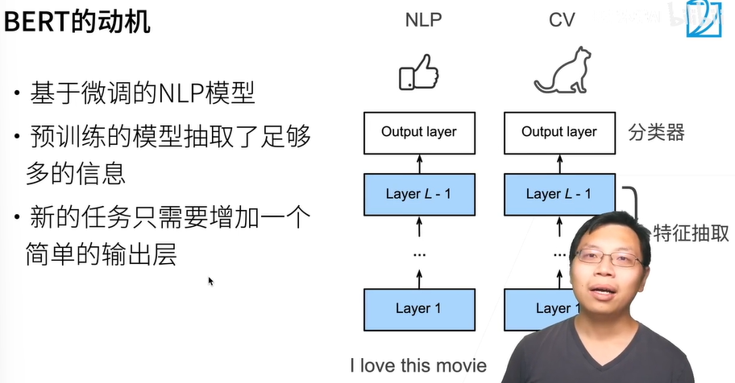
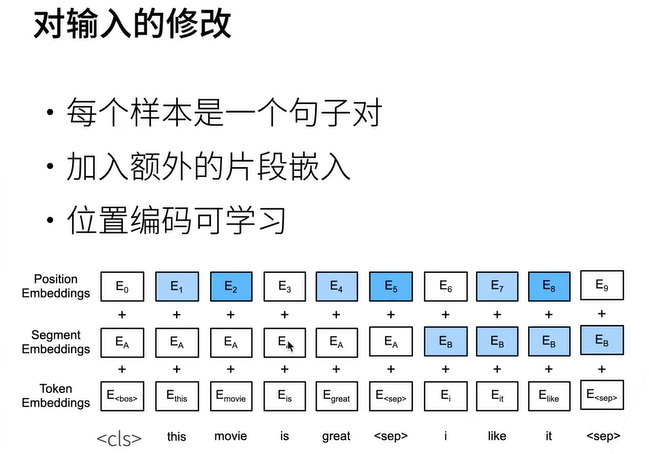
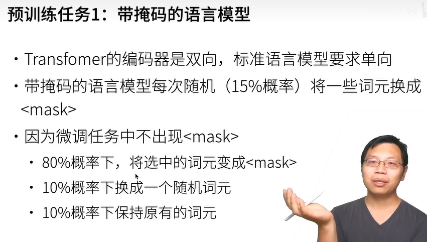
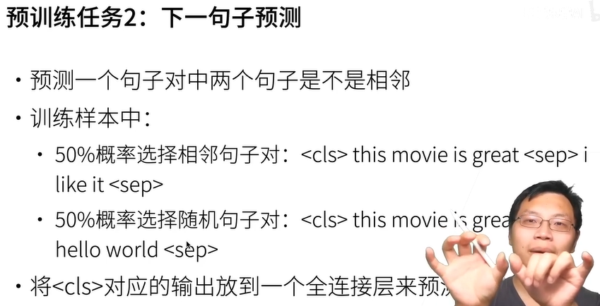
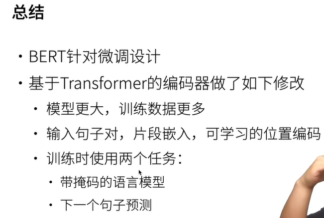

# 一、架构

BERT的预训练：做一个完形填空。












每个样本是一个序列，这个序列表示一个句子对，segments为[0, 0, 0, 1, 1]，0表示这个token属于第一句，1表示这个token属于第二句，经过segment embedding层处理得到segment embedding。

position embedding是随机初始化的[batch_size, seq_len, num_hiddens]的tensor，经过训练得到应有的值。




用原词作label，和经过BERT处理的被选中的mask词作损失。




每个序列对应一个二分类任务，label为0或1，表示第二句是第一句的下一句或不是。




总流程：

1. 将句子对分词后按15%选取部分token用作掩蔽token，对这些掩蔽token按80%的几率替换成mask token，10％的几率随机换成词典里的其他token，10%的几率不变。

   > 不直接全换成mask token，是因为微调时没有mask token，要符合微调时的情况，不能让BERT模型只会识别mask token。

2. 将预处理后的句子对添加cls和seq特殊token，拼成一个序列。

3. 将序列送入BERT，经过处理，得到序列长度不变而维度为num_hiddens的序列。

4. next sentence predict：取出cls token对应的向量，送入一个线性层进行二分类，和NSP任务对应的label计算$l_{NSP}$。

5. masked language model：取出掩蔽token对应的向量，送入线性层进行多分类，根据他们实际是什么词对应的label，计算$l_{MLM}$。

6. 计算总损失$l = l_{NSP} + l_{MLM}$，再梯度反向传播优化模型。


# 二、预训练及微调

**BERT-Tiny模型预训练以及在生成式问答任务微调**

  1. 预训练部分核心逻辑

- **模型结构** **：BERT-Tiny 包含 2 层 Transformer 编码器，隐藏维度 128，计算量仅为标准 BERT 的 1/50 左右。-** MLM 任务 **：随机掩码 15% 的 tokens（80% 替换为 [MASK]，10% 随机替换，10% 保留原词），训练模型预测掩码内容。-** NSP 任务 **：判断两个句子是否连续（50% 正例，50% 负例），增强模型对句子关系的理解。-** 

- **数据处理**：使用维基百科文本生成句子对，模拟自然语言的上下文关系。


  2. 生成式问答微调核心逻辑

- **模型结构**：采用 “BERT 编码器 + 线性解码器” 的简易架构（实际可替换为 Transformer 解码器提升性能），编码器处理 “问题 + 上下文”，解码器生成答案。
- **数据处理**：将输入格式化为 “问题：xxx 上下文：xxx”，目标为自然语言答案，使用 MS MARCO 数据集（真实搜索问答场景）。
- **评估指标**：使用 BLEU 分数衡量生成答案与标准答案的词级重叠度（生成式 QA 常用指标）。
- **预测逻辑**：通过 argmax 从模型输出的 logits 中解码出答案文本，跳过特殊符号（如 [PAD]、[CLS]）。


  3. 扩展建议

- **模型优化**：解码器可替换为 Transformer 解码器（如 T5 的结构），提升长答案生成能力。
- **数据增强**：对问题进行同义词替换、上下文截断等，增强模型鲁棒性。
- **指标扩展**：添加 ROUGE（适合长文本）和 BERTScore（语义相似度）作为评价指标。


# 三、代码

## 1. 预训练部分

纯手动实现，增进理解。

```python
import os
os.environ["TRANSFORMERS_OFFLINE"] = "1"
os.environ["CUDA_LAUNCH_BLOCKING"] = "1"

import torch
import torch.nn as nn
import torch.optim as optim
from torch.utils.data import DataLoader
from torch.nn.utils import clip_grad_norm_
from transformers import BertTokenizerFast, DataCollatorForLanguageModeling
from datasets import load_dataset
import time
import math
import os

# -------------------------- 1. 配置参数 --------------------------
# 模型架构参数
VOCAB_SIZE = 30522  # BERT-base-uncased 的词汇表大小
HIDDEN_SIZE = 128  # BERT-Tiny 的隐藏层维度
NUM_LAYERS = 2  # Transformer 编码器层数
NUM_HEADS = 8  # 多头注意力的头数
INTERMEDIATE_SIZE = 512  # 前馈网络的中间层维度
MAX_SEQ_LENGTH = 128  # 最大序列长度
DROPOUT = 0.1  # Dropout 概率

# 训练参数
MODEL_NAME = "manual-bert-tiny"
BATCH_SIZE = 32
EPOCHS = 10
LEARNING_RATE = 5e-5
WEIGHT_DECAY = 0.01
MASK_PROB = 0.15
LOG_STEPS = 100
SAVE_DIR = f"./{MODEL_NAME}-pretrained"
DEVICE = torch.device("cuda" if torch.cuda.is_available() else "cpu")

# 数据集配置
DATA_PATH = "wikitext"
DATA_CONFIG = "wikitext-103-raw-v1"


# -------------------------- 2. 手动实现 BERT 核心组件 --------------------------
class EmbeddingLayer(nn.Module):
    """
    嵌入层：将 token ID 转换为向量，并添加位置信息和段信息
    """

    def __init__(self, vocab_size, hidden_size, max_seq_length, dropout):
        super().__init__()

        self.word_embedding = nn.Embedding(vocab_size, hidden_size, padding_idx=0)
        self.position_embedding = nn.Embedding(vocab_size, hidden_size)
        self.token_type_embedding = nn.Embedding(2, hidden_size)

        self.layer_norm = nn.LayerNorm(max_seq_length)
        self.dropout = nn.Dropout(dropout)

        self.register_buffer("position_ids", torch.arange(0, max_seq_length).expand((1, -1)))

    def forward(self, input_ids, token_type_ids=None):
        batch_size, seq_len = input_ids.shape

        # 1.获取词嵌入
        # (b, seq_len) -> (b, seq_len, hidden_size)
        word_embedding = self.word_embedding(input_ids)

        # 获取位置嵌入
        # (1, max_seq_len) -> (1, seq_len) -> (b, seq_len) -> (b, seq_len, hidden_size)
        position_embedding = self.position_embedding(self.position_ids[:, :seq_len].expand_as(input_ids))

        # 获取段嵌入
        # 在预训练的下一句预测（NSP） 任务中：
        # 输入是两个句子拼接而成的，例如[CLS] Sentence A[SEP] Sentence B[SEP]。
        # token_type_ids 会为第一个句子（Sentence A）的所有token分配一个ID（通常是0）。
        # 为第二个句子（SentenceB）的所有token分配另一个ID（通常是1）。
        # 这样，模型就能知道哪些token属于第一句，哪些属于第二句，从而学习句子之间的关系。
        # 在单句输入的场景中：
        # 整个输入只有一个句子，例如[CLS] This is a single sentence.[SEP]。
        # 此时，token_type_ids 可以全部设为0。
        # 这行代码token_type_ids = torch.zeros_like(input_ids)正是为这种情况提供了一个默认值。
        if token_type_ids is None:
            token_type_ids = torch.zeros_like(input_ids)
        token_type_embedding = self.token_type_embedding(token_type_ids)

        # 输入张量 = 词嵌入 + 位置嵌入 + 段嵌入
        embedding = word_embedding + position_embedding + token_type_embedding
        embedding = self.layer_norm(embedding)
        embedding = self.dropout(embedding)
        return embedding


class MultiHeadAttention(nn.Module):
    def __init__(self, hidden_size, num_heads, dropout):
        super().__init__()
        self.W_q = nn.Linear(hidden_size, hidden_size)
        self.W_k = nn.Linear(hidden_size, hidden_size)
        self.W_v = nn.Linear(hidden_size, hidden_size)

        self.hidden_size = hidden_size
        self.num_heads = num_heads
        self.hidden_dim = hidden_size // num_heads

        self.out_proj = nn.Linear(hidden_size, hidden_size)
        self.dropout = nn.Dropout(dropout)

    def forward(self, q, k, v, attention_mask=None):
        # k和v的序列长度相同，q、k和v的维度相同
        batch_size, seq_len_q, _ = q.shape
        _, seq_len_k, _ = k.shape

        q = self.W_q(q)
        k = self.W_k(k)
        v = self.W_v(v)

        # 划分多头
        q = q.view(batch_size, seq_len_q, self.num_heads, self.hidden_dim).transpose(1, 2).contiguous()
        k = k.view(batch_size, seq_len_k, self.num_heads, self.hidden_dim).transpose(1, 2).contiguous()
        v = v.view(batch_size, seq_len_k, self.num_heads, self.hidden_dim).transpose(1, 2).contiguous()

        # 计算注意力分数
        # (b, num_heads, seq_len_q, d) * (b, num_heads, n, seq_len_k) -> (b, num_heads, seq_len_q, seq_len_k)
        attn_scores = torch.matmul(q, k.transpose(2, 3)) / math.sqrt(self.hidden_dim)

        # 掩码掩蔽
        if attention_mask is not None:
            attn_scores = attn_scores.masked_fill(attention_mask, 1e-9)

        # 计算注意力权重
        attn_weights = nn.functional.softmax(attn_scores, dim=-1)

        # 加权求和得到输出
        # (b, num_heads, seq_len_q, seq_len_k) * (b, num_heads, seq_len_k, d) -> (b, num_heads, seq_len_q, d)
        output = torch.matmul(attn_weights, v)

        # 多头合并
        output = output.transpose(1, 2).reshape(batch_size, seq_len_q, -1).contiguous()

        # 最终线性投影
        output = self.out_proj(output)

        return output


class FeedForwardNetwork(nn.Module):
    def __init__(self, hidden_size, intermediate_size, dropout):
        super().__init__()
        self.fc1 = nn.Linear(hidden_size, intermediate_size)
        self.activate = nn.GELU()
        self.dropout = nn.Dropout(dropout)
        self.fc2 = nn.Linear(intermediate_size, hidden_size)

    def forward(self, x):
        x = self.fc1(x)
        x = self.activate(x)
        x = self.dropout(x)
        x = self.fc2(x)
        return x


class EncoderBlock(nn.Module):
    def __init__(self, hidden_size, intermediate_size, num_heads, dropout):
        super().__init__()
        self.self_attn = MultiHeadAttention(hidden_size, num_heads, dropout)
        self.ffn = FeedForwardNetwork(hidden_size, intermediate_size, dropout)

        self.norm1 = nn.LayerNorm(hidden_size, eps=1e-12)
        self.norm2 = nn.LayerNorm(hidden_size, eps=1e-12)

        self.dropout1 = nn.Dropout(dropout)
        self.dropout2 = nn.Dropout(dropout)

    def forward(self, hidden_states, attention_mask=None):
        """
        Args:
            hidden_states: 输入向量, 形状: (batch_size, seq_len, hidden_size)
            attention_mask: 注意力掩码, 形状: (batch_size, 1, 1, seq_len)
        Returns:
            编码器块输出, 形状: (batch_size, seq_len, hidden_size)
        """
        attn_output = self.self_attn(hidden_states, hidden_states, hidden_states, attention_mask)
        hidden_states = self.norm1(hidden_states + self.dropout1(attn_output))

        ffn_output = self.ffn(hidden_states)
        hidden_states = self.norm2(hidden_states + self.dropout2(ffn_output))

        return hidden_states


class BERTModel(nn.Module):
    def __init__(self, vocab_size, hidden_size, num_layers, num_heads, intermediate_size, max_seq_length, dropout):
        super().__init__()
        self.embedding = EmbeddingLayer(vocab_size, hidden_size, max_seq_length, dropout)
        self.encoderLayers = nn.ModuleList([
            EncoderBlock(hidden_size, intermediate_size, num_heads, dropout)
            for _ in range(num_layers)
        ])
        self.pooler = nn.Linear(hidden_size, hidden_size)
        self.activate = nn.Tanh()

    def forward(self, input_ids, token_type_ids=None, attention_mask=None):
        """
        Args:
            input_ids: 输入 token 的 ID, 形状: (batch_size, seq_len)
            token_type_ids: 段编码 ID, 形状: (batch_size, seq_len)
            attention_mask: 注意力掩码, 形状: (batch_size, seq_len)
        Returns:
            sequence_output: 序列输出, 形状: (batch_size, seq_len, hidden_size)
            pooled_output: [CLS] token 的输出, 形状: (batch_size, hidden_size)
        """
        # 1.获取embedding
        embedding_output = self.embedding(input_ids, token_type_ids)

        # 2. 准备注意力掩码
        # todo 这段啥意思没看懂，等debug时好好看看数据变化
        if attention_mask is not None:
            # (batch_size, seq_len) -> (batch_size, 1, 1, seq_len)
            attention_mask = attention_mask.unsqueeze(1).unsqueeze(2)
            # [1, 1, 0, 0, 0] -> [False, False, True, True, True]
            attention_mask = attention_mask == 0
            # attention_mask = (1.0 - attention_mask) * -10000.0
# todo [1, 1, 0, 0, 0] -> [-0, -0, -10000, -10000]
        # 3.经过编码器层
        hidden_states = embedding_output
        for layer in self.encoderLayers:
            hidden_states = layer(hidden_states, attention_mask)

        # 4.序列输出和池化输出
        # [b, n, hidden_size]
        sequence_output = hidden_states
        # 使用 [CLS] token 的输出作为句子表示
        pooled_output = self.pooler(sequence_output[:, 0, :])
        # [b, hidden_size]
        pooled_output = self.activate(pooled_output)

        return sequence_output, pooled_output


class BERTForPreTraining(nn.Module):
    """
    BERT 预训练模型，包含 MLM 和 NSP 头
    """

    def __init__(self, bert_model, vocab_size):
        super().__init__()
        self.bert = bert_model
        self.vocab_size = vocab_size

        # MLM头
        self.mlm_head = nn.Linear(self.bert.embedding.word_embedding.embedding_dim, vocab_size)

        # NSP头
        self.nsp_head = nn.Linear(self.bert.pooler.out_features, 2)

        # 权重共享
        self.mlm_head.weight = self.bert.embedding.word_embedding.weight

    def forward(self, input_ids, token_type_ids=None, attention_mask=None, labels=None, next_sentence_label=None):
        """
        Args:
            input_ids: 输入 token 的 ID, 形状: (batch_size, seq_len)
            token_type_ids: 段编码 ID, 形状: (batch_size, seq_len)
            attention_mask: 注意力掩码, 形状: (batch_size, seq_len)
            labels: MLM 任务的真实标签, 形状: (batch_size, seq_len)
            next_sentence_label: NSP 任务的真实标签, 形状: (batch_size,)
        Returns:
            包含损失和预测的字典
        """
        # 1. 获取 BERT 模型输出
        sequence_output, pooled_output = self.bert(
            input_ids=input_ids,
            token_type_ids=token_type_ids,
            attention_mask=attention_mask
        )

        # 2.计算MLM预测
        # [b, n, hidden_size] -> [b, n, vocab_size]
        mlm_logits = self.mlm_head(sequence_output)

        # 3.计算NSP预测
        # [b, hidden_size] -> [b, 2]
        nsp_logits = self.nsp_head(pooled_output)

        outputs = {
            "mlm_logits": mlm_logits,
            "nsp_logits": nsp_logits
        }

        # 4.如果提供了标签，计算损失
        if labels is not None and next_sentence_label is not None:
            # MLM损失
            # MLM只对被掩蔽部分计算损失，其他没掩蔽的就置为-100，不用计算损失
            loss_fct = nn.CrossEntropyLoss(ignore_index=-100)
            mlm_loss = loss_fct(mlm_logits.view(-1, self.vocab_size), labels.view(-1))

            # NSP损失
            # print("检查 next_sentence_label 的值:")
            # print(next_sentence_label)
            # print("next_sentence_label 中的最小值:", next_sentence_label.min().item())
            # print("next_sentence_label 中的最大值:", next_sentence_label.max().item())

            nsp_loss = loss_fct(nsp_logits.view(-1, 2), next_sentence_label.view(-1))

            # 总损失
            total_loss = mlm_loss + nsp_loss
            outputs["loss"] = total_loss
            outputs["mlm_loss"] = mlm_loss
            outputs["nsp_loss"] = nsp_loss

        return outputs


# -------------------------- 3. 数据加载与预处理（同之前版本） --------------------------
def load_and_preprocess_data():
    dataset = load_dataset(DATA_PATH, DATA_CONFIG)

    def filter_empty(example):
        return len(example["text"].strip()) > 0
    dataset = dataset.filter(filter_empty)

    tokenizer = BertTokenizerFast.from_pretrained("bert-base-uncased")

    def tokenized_function(example):
        sentences = []
        for text in example["text"]:
            sents = [s.strip() for s in text.split('.') if s.strip()]
            sentences.extend(sents)

        pairs = []
        labels = []
        # 50％概率是相邻2个句子，50％不是
        for i in range(len(sentences) - 1):
            if torch.rand(1).item() > 0.5:
                pairs.append((sentences[i], sentences[i + 1]))
                labels.append(1)
            else:
                rand_idx = torch.randint(0, len(sentences), (1,)).item()
                pairs.append((sentences[i], sentences[rand_idx]))
                labels.append(0)

        tokenized = tokenizer(
            [p[0] for p in pairs],
            [p[1] for p in pairs],
            truncation=True,
            max_length = MAX_SEQ_LENGTH,
            padding="max_length",
            return_tensors="pt"
        )
        tokenized["next_sentence_label"] = torch.tensor(labels, dtype=torch.long)
        return tokenized

    tokenized_dataset = dataset.map(
        tokenized_function,
        batched=True,
        remove_columns=["text"],
        # 4的时候运行报错
        # num_proc=4
        num_proc=1
    )
    tokenized_dataset.set_format("torch", columns=["input_ids", "attention_mask", "token_type_ids", "next_sentence_label"])

    return tokenized_dataset["train"], tokenized_dataset["validation"]


# -------------------------- 4. 手动训练循环 --------------------------
def main():
    # 1.加载分词器和数据
    tokenizer = BertTokenizerFast.from_pretrained("bert-base-uncased", local_files_only=True)
    train_dataset, val_dataset = load_and_preprocess_data()
    print(f"训练集样本数：{len(train_dataset)}，验证机样本数：{len(val_dataset)}")

    # 2.初始化数据加载器
    data_collator = DataCollatorForLanguageModeling(
        tokenizer=tokenizer,
        mlm=True,
        mlm_probability=MASK_PROB
    )
    train_loader = DataLoader(
        dataset=train_dataset,
        batch_size=BATCH_SIZE,
        shuffle=True,
        collate_fn=data_collator,
        num_workers=4
    )
    val_loader = DataLoader(
        dataset=val_dataset,
        batch_size=BATCH_SIZE,
        shuffle=False,
        collate_fn=data_collator,
        num_workers=4
    )

    # 3.手动初始化模型、优化器、学习率调度器
    print("正在初始化手动实现的 BERT-Tiny 模型...")
    bert_base_model = BERTModel(
        vocab_size=VOCAB_SIZE,
        hidden_size=HIDDEN_SIZE,
        num_layers=NUM_LAYERS,
        num_heads=NUM_HEADS,
        intermediate_size=INTERMEDIATE_SIZE,
        max_seq_length=MAX_SEQ_LENGTH,
        dropout=DROPOUT
    )
    model = BERTForPreTraining(
        bert_model=bert_base_model,
        vocab_size=VOCAB_SIZE
    ).to(device=DEVICE)

    optimizer = optim.AdamW(
        params=model.parameters(),
        lr = LEARNING_RATE,
        weight_decay=WEIGHT_DECAY
    )

    total_steps = len(train_loader) * EPOCHS
    scheduler = optim.lr_scheduler.LinearLR(
        optimizer=optimizer,
        start_factor=1.0,
        end_factor=0.0,
        total_iters=total_steps
    )

    # 4.创建模型保存目录
    os.makedirs(SAVE_DIR, exist_ok=True)

    # 5.训练循环
    best_val_loss = float("inf")
    for epoch in range(EPOCHS):
        start_time = time.time()

        # -------------------------- 训练阶段 --------------------------
        model.train()
        train_loss, train_mlm_loss, train_nsp_loss = 0.0, 0.0, 0.0
        for step, batch in enumerate(train_loader):
            # 观察数据：打印第一个 batch 的形状（仅在第一步）
            if step == 0 and epoch == 0:
                print("\n--- 数据形状观察 ---")
                print(f"input_ids shape: {batch['input_ids'].shape}")
                print(f"attention_mask shape: {batch['attention_mask'].shape}")
                print(f"token_type_ids shape: {batch['token_type_ids'].shape}")
                print(f"labels shape: {batch['labels'].shape}")
                print(f"next_sentence_label shape: {batch['next_sentence_label'].shape}")
                print("-------------------\n")

            batch = {k: v.to(DEVICE) for k, v in batch.items()}

            # 前向传播
            outputs = model(
                input_ids=batch["input_ids"],
                attention_mask=batch["attention_mask"],
                token_type_ids=batch["token_type_ids"],
                labels=batch["labels"],
                next_sentence_label=batch["next_sentence_label"]
            )

            loss = outputs["loss"]

            # 反向传播
            optimizer.zero_grad()
            loss.backward()

            clip_grad_norm_(model.parameters(), max_norm=1.0)

            optimizer.step()
            scheduler.step()

            # 累计损失
            train_loss += loss.item()
            train_mlm_loss += outputs["mlm_loss"].item()
            train_nsp_loss += outputs["nsp_loss"].item()

            # 打印训练日志
            if (step + 1) % LOG_STEPS == 0:
                avg_loss = train_loss / (step + 1)
                avg_mlm_loss = train_mlm_loss / (step + 1)
                avg_nsp_loss = train_nsp_loss / (step + 1)
                print(f"Epoch {epoch+1}/{EPOCHS}, Step {step+1}/{len(train_loader)}, "
                      f"Total Loss: {avg_loss:.4f}, "
                      f"MLM Loss: {avg_mlm_loss:.4f}, "
                      f"NSP Loss: {avg_nsp_loss:.4f}, "
                      f"LR: {scheduler.get_last_lr()[0]:.6f}")

        avg_train_loss = train_loss / len(train_loader)

        # -------------------------- 验证阶段 --------------------------
        model.eval()
        val_loss = 0.0
        with torch.no_grad():
            for batch in val_loader:
                batch = {k: v.to(DEVICE) for k, v in batch.items()}
                outputs = model(
                    input_ids=batch["input_ids"],
                    attention_mask=batch["attention_mask"],
                    token_type_ids=batch["token_type_ids"],
                    labels=batch["labels"],
                    next_sentence_label=batch["next_sentence_label"]
                )
                val_loss += outputs["loss"].item()

        avg_val_loss = val_loss / len(val_loader)

        # 打印epoch总结
        epoch_time = time.time() - start_time
        print(f"\nEpoch {epoch+1} 总结：")
        print(f"训练损失：{avg_train_loss:.4f}，验证损失：{avg_val_loss:.4f}，耗时：{epoch_time:.2f}秒")

        # 保存最佳模型
        if avg_val_loss < best_val_loss:
            best_val_loss = avg_val_loss
            # 手动保存模型状态字典
            torch.save({
                'epoch': epoch,
                'model_state_dict': model.state_dict(),
                'optimizer_state_dict': optimizer.state_dict(),
                'loss': avg_val_loss,
            }, f"{SAVE_DIR}/best_model.pth")
            tokenizer.save_pretrained(f"{SAVE_DIR}/best_model")
            print(f"保存最佳模型（验证损失：{best_val_loss:.4f}）\n")

            # 一个epoch训练完就保存一下，因为训练时间太长，估计只能训练一个epoch了
            torch.save(model.state_dict(), f"{SAVE_DIR}/final_model.pth")
            tokenizer.save_pretrained(f"{SAVE_DIR}/final_model")
            print(f"预训练完成！最佳模型保存至：{SAVE_DIR}/best_model.pth")
            print(f"最终模型权重保存至：{SAVE_DIR}/final_model.pth")

    # 训练结束后保存最终模型
    torch.save(model.state_dict(), f"{SAVE_DIR}/final_model.pth")
    tokenizer.save_pretrained(f"{SAVE_DIR}/final_model")
    print(f"预训练完成！最佳模型保存至：{SAVE_DIR}/best_model.pth")
    print(f"最终模型权重保存至：{SAVE_DIR}/final_model.pth")


if __name__ == "__main__":
    main()

```


## 2. 微调部分

用了2次BERT，一次作tokenizer，一次作网络模型。tokenizer是把自然语言翻译成词汇表的序号，并加上cls token、seq token、padding token等特殊token。网络模型是对翻译后的token序列进行语义理解和预测。

```python
import os

from manual_bert_tiny_pretraining import BERTForPreTraining, BERTModel

os.environ["TRANSFORMERS_OFFLINE"] = "1"

import torch
import numpy as np
from torch.utils.data import Dataset, DataLoader
from transformers import (
    BertTokenizerFast,
    BertModel,
    Seq2SeqTrainingArguments,
    Seq2SeqTrainer,
    AutoModelForSeq2SeqLM,
    DataCollatorForSeq2Seq,
    PreTrainedModel,
    GenerationConfig,
    PretrainedConfig
)
from datasets import load_dataset
import evaluate  # 用于计算BLEU等指标
from safetensors.torch import save_file


# 定义模型配置类（继承PretrainedConfig）
class BertQAConfig(PretrainedConfig):
    model_type = "bert-qa"
    def __init__(self, vocab_size=30522, hidden_size=128, num_layers=2, num_heads=8, **kwargs):
        super().__init__(**kwargs)
        self.vocab_size = vocab_size
        self.hidden_size = hidden_size
        self.num_layers = num_layers
        self.num_heads = num_heads


# 定义生成式问答模型（BERT编码器 + 解码器）
class BertQAModel(PreTrainedModel):
    config_class = BertQAConfig  # 关联配置类
    def __init__(self, bert_model, hidden_size, vocab_size, tokenizer, config):
        super().__init__(config=config)
        self.encoder = bert_model  # BERT编码器
        self.decoder = torch.nn.Linear(hidden_size, vocab_size)  # 解码器（简单线性层，实际可用LSTM/Transformer）
        self.vocab_size = vocab_size
        self.tokenizer = tokenizer

        # 自动继承generation_config（PreTrainedModel内置）
        self.generation_config = GenerationConfig.from_model_config(config)
        self.generation_config.max_length = 64
        self.generation_config.pad_token_id = 0
        self.generation_config.eos_token_id = 102

    def forward(self, input_ids, attention_mask, labels=None):
        # 编码器输出：(batch_size, seq_len, hidden_size)
        # 调用hugging face的模型可以这样获取last_hidden_state
        # encoder_outputs = self.encoder(input_ids=input_ids, attention_mask=attention_mask).last_hidden_state
        encoder_outputs = self.encoder(input_ids=input_ids, attention_mask=attention_mask)["last_hidden_state"]

        # 解码器预测：(batch_size, seq_len, vocab_size)
        logits = self.decoder(encoder_outputs)

        if labels is not None:
            # 计算损失（交叉熵）
            # loss_fct = torch.nn.CrossEntropyLoss(ignore_index=self.tokenizer.pad_token_id)
            loss_fct = torch.nn.CrossEntropyLoss(ignore_index=-100)
            # loss = loss_fct(logits.transpose(1, 2), labels)  # logits需转置为(batch, vocab, seq)
            logits = logits.view(-1, self.vocab_size)
            labels = labels.view(-1)
            loss = loss_fct(logits, labels)
            # loss = loss_fct(logits.view(-1, self.vocab_size), labels.view(-1))
            return {"loss": loss, "logits": logits}
        return {"logits": logits}

    def generate(self, input_ids, attention_mask, max_length=None, **kwargs):
        """模拟生成：贪心解码，取每个位置logits最大的token"""
        # 使用内置的generation_config
        max_len = max_length if max_length else self.generation_config.max_length
        with torch.no_grad():
            outputs = self.forward(input_ids=input_ids, attention_mask=attention_mask)
            pred_ids = torch.argmax(outputs["logits"], dim=-1)
        return pred_ids[:, :max_len]


def compute_metrics(eval_preds, tokenizer, bleu):
    """计算生成答案的BLEU分数（衡量与标准答案的词级重叠度）"""
    preds, labels = eval_preds
    # 将logits转换为文本（取argmax）
    pred_ids = np.argmax(preds, axis=-1)
    # 解码预测和标签（忽略-100）
    pred_texts = tokenizer.batch_decode(pred_ids, skip_special_tokens=True)
    labels = np.where(labels != -100, labels, tokenizer.pad_token_id)
    label_texts = tokenizer.batch_decode(labels, skip_special_tokens=True)
    # 计算BLEU分数
    results = bleu.compute(predictions=pred_texts, references=[[text] for text in label_texts])
    return {"bleu": results["bleu"] * 100}  # 转换为百分比


# -------------------------- 3. 预处理生成式问答数据集 --------------------------
def preprocess_qa_dataset(dataset_name, dataset_version, tokenizer, max_input_length, max_target_length):
# def preprocess_qa_dataset(tokenizer):
    dataset = load_dataset(dataset_name, dataset_version)
    print(f"dataset: {dataset}")
    # train_dataset = dataset["train"]
    # print(train_dataset)
    # print(train_dataset["answers"])


    # 过滤无答案的样本
    def filter_empty_answers(example):
        """过滤无有效答案的样本：
        - 排除answers为空列表的样本
        - 排除answers中所有text为空字符串的样本
        返回True表示要留
        """
        # answers = example.get("answers", [])
        # answers = example["answers"]
        # if not answers:  # answers为空列表
        #     return False
        # # 检查是否存在至少一个非空答案文本
        # has_valid_answer = any(ans.get("text", "").strip() for ans in answers)
        # return has_valid_answer
        answers = example["answers"]
        if len(answers) == 0:
            return False
        for answer in answers:
            if len(answer) > 0:
                return True
        return False

    dataset = dataset.filter(filter_empty_answers)
    print(f"dataset: {dataset}")

    def preprocess_function(examples):
        # 输入："问题：[question] 上下文：[context]"
        # query = examples["query"]
        # print(query)
        # context = examples["passages"]["passage_text"][0]
        # print(context)
        # inputs = ["问题：" + q + " 上下文：" + c["passage_text"][0]
        #           for q, c in zip(examples["query"], examples["passages"])]
        # 空列表
        inputs = []
        for i in range(len(examples["query"])):
            q = examples["query"][i]
            c = examples["passages"][i]["passage_text"][0]
            inputs.append(f"问题：{q} 上下文：{c}")

        # 目标：答案文本（取第一个有效答案）
        targets = []
        for i in range(len(examples["answers"])):
            answers = examples["answers"][i]
            for answer in answers:
                if len(answer) > 0:
                    targets.append(answer)
                    break
        # 分词处理
        model_inputs = tokenizer(
            inputs,
            max_length=max_input_length,
            truncation=True,
            padding="max_length",
            return_tensors="pt"
        )
        print(f"model_inputs: {model_inputs}")
        labels = tokenizer(
            targets,
            max_length=max_target_length,
            truncation=True,
            padding="max_length",
            return_tensors="pt"
        )["input_ids"]
        print(f"labels: {labels}")

        # 填充部分设为 -100（忽略损失计算）
        labels = torch.where(labels == tokenizer.pad_token_id, -100, labels)
        print(f"labels: {labels}")
        model_inputs["labels"] = labels
        print(f"model_inputs: {model_inputs}")
        return model_inputs

    # 应用预处理（批量处理加速）
    tokenized_dataset = dataset.map(
        preprocess_function,
        batched=True,
        remove_columns=dataset["train"].column_names,
        num_proc=4
    )
    # tokenized_dataset.set_format("torch", columns=["input_ids", "attention_mask", "labels"])
    for split in tokenized_dataset.keys():
        # test数据集没数据，所以去掉，否则会因为没有下列columns报错
        if split == "test":
            break
        tokenized_dataset[split].set_format(
            "torch",
            columns=["input_ids", "attention_mask", "labels"]
        )

    # 截取部分样本加速训练（可选，根据硬件调整）
    train_dataset = tokenized_dataset["train"].shuffle(seed=42).select(range(10000))
    val_dataset = tokenized_dataset["validation"].select(range(1000))

    return train_dataset, val_dataset

# -------------------------- 5. 微调主流程 --------------------------
def main():
    # -------------------------- 1. 配置参数 --------------------------
    # 预训练模型和分词器路径
    PRETRAINED_MODEL_PATH = "./manual-bert-tiny-pretrained/final_model.pth"
    PRETRAINED_TOKENIZER_PATH = "./manual-bert-tiny-pretrained/final_model"
    QA_DATASET = "ms_marco"  # 生成式问答数据集（MS MARCO）
    DATASET_VERSION = "v2.1"
    BATCH_SIZE = 16
    EPOCHS = 5
    LEARNING_RATE = 3e-5
    MAX_INPUT_LENGTH = 128  # 问题+上下文的最大长度
    MAX_TARGET_LENGTH = 64  # 答案的最大长度
    SAVE_DIR = "./bert-tiny-qa-finetuned"
    DEVICE = torch.device("cuda" if torch.cuda.is_available() else "cpu")

    # 模型架构参数
    VOCAB_SIZE = 30522  # BERT-base-uncased 的词汇表大小
    HIDDEN_SIZE = 128  # BERT-Tiny 的隐藏层维度
    NUM_LAYERS = 2  # Transformer 编码器层数
    NUM_HEADS = 8  # 多头注意力的头数
    INTERMEDIATE_SIZE = 512  # 前馈网络的中间层维度
    MAX_SEQ_LENGTH = 128  # 最大序列长度，大于等于经过tokenizer处理的输出序列的最大长度
    DROPOUT = 0.1  # Dropout 概率

    # -------------------------- 2. 加载分词器和模型 --------------------------
    # 加载预训练的BERT-Tiny分词器
    tokenizer = BertTokenizerFast.from_pretrained("bert-base-uncased")

    # 加载预处理数据
    train_dataset, val_dataset = preprocess_qa_dataset(
        QA_DATASET,
        DATASET_VERSION,
        tokenizer,
        MAX_INPUT_LENGTH,
        MAX_TARGET_LENGTH
    )
    print(f"训练集样本数：{len(train_dataset)}，验证集样本数：{len(val_dataset)}")

    # 加载BERT-Tiny编码器并初始化问答模型
    # bert_encoder = BertModel.from_pretrained(PRETRAINED_MODEL_PATH)
    bert_encoder_weight = torch.load(PRETRAINED_MODEL_PATH)

    bert_base_model = BERTModel(
        vocab_size=VOCAB_SIZE,
        hidden_size=HIDDEN_SIZE,
        num_layers=NUM_LAYERS,
        num_heads=NUM_HEADS,
        intermediate_size=INTERMEDIATE_SIZE,
        max_seq_length=MAX_SEQ_LENGTH,
        dropout=DROPOUT
    )
    bert_encoder = BERTForPreTraining(
        bert_model=bert_base_model,
        vocab_size=VOCAB_SIZE
    )
    bert_encoder.load_state_dict(bert_encoder_weight)

    # 初始化模型时传入配置
    qa_config = BertQAConfig(
        vocab_size=VOCAB_SIZE,
        hidden_size=HIDDEN_SIZE,
        num_layers=NUM_LAYERS,
        num_heads=NUM_HEADS
    )

    model = BertQAModel(
        bert_model=bert_encoder,
        hidden_size=HIDDEN_SIZE,
        vocab_size=tokenizer.vocab_size,
        tokenizer=tokenizer,
        config=qa_config
    ).to(DEVICE)

    # 数据收集器（处理批次内的padding）
    data_collator = DataCollatorForSeq2Seq(
        tokenizer=tokenizer,
        model=model,
        padding="max_length",
        max_length=MAX_INPUT_LENGTH
    )

    # 训练参数
    training_args = Seq2SeqTrainingArguments(
        output_dir="./bert-tiny-qa-finetuned",
        overwrite_output_dir=True,
        num_train_epochs=EPOCHS,
        per_device_train_batch_size=BATCH_SIZE,
        per_device_eval_batch_size=BATCH_SIZE,
        learning_rate=LEARNING_RATE,
        logging_dir="./qa-logs",
        logging_steps=100,
        eval_strategy="epoch",
        save_strategy="epoch",
        save_safetensors=True,  # 用safetensors格式保存
        load_best_model_at_end=True,
        predict_with_generate=True,  # 评估时生成答案
        report_to="none"  # 不向任何外部平台（如 WandB、MLflow）报告训练日志
    )

    # -------------------------- 4. 定义评估指标（BLEU分数） --------------------------
    bleu = evaluate.load("bleu")

    # 初始化Trainer
    trainer = Seq2SeqTrainer(
        model=model,
        args=training_args,
        train_dataset=train_dataset,
        eval_dataset=val_dataset,
        data_collator=data_collator,
        compute_metrics=lambda eval_preds : compute_metrics(eval_preds, tokenizer, bleu)
    )

    # 开始微调
    print("开始微调生成式问答模型...")
    trainer.train()

    # 保存模型权重（state_dict）
    save_file(model.state_dict(), f"{SAVE_DIR}/model.safetensors")

    tokenizer.save_pretrained("./bert-tiny-qa-final")
    print(f"微调完成，模型保存至：{SAVE_DIR}/model.safetensors")

    # 示例预测
    example_question = "BERT模型是由哪个公司提出的？"
    example_context = "BERT是2018年由Google公司的AI团队开发的预训练语言模型。"
    input_text = f"问题：{example_question} 上下文：{example_context}"
    inputs = tokenizer(input_text, return_tensors="pt", truncation=True, max_length=MAX_INPUT_LENGTH).to(DEVICE)
    model.eval()
    with torch.no_grad():
        # outputs = model(**inputs)
        outputs = model(inputs["input_ids"], inputs["attention_mask"])
    pred_ids = torch.argmax(outputs["logits"], dim=-1)
    pred_answer = tokenizer.decode(pred_ids[0], skip_special_tokens=True)
    print(f"\n示例预测：")
    print(f"问题：{example_question}")
    print(f"预测答案：{pred_answer}")  # 预期输出："Google公司"


if __name__ == "__main__":
    main()

```

