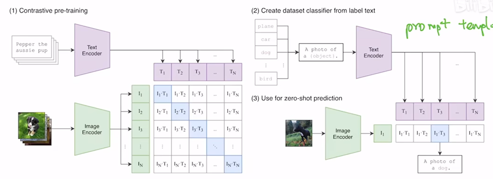

# 理论




CLIP的大致原理：

数据集是成批的图像与文本的配对，使用对比学习，当图像与文本是正确配对时，期望输出正确率趋于1，否则趋于0。模型把图像和文本分别经过各自的编码器（比如图像用resnet或ViT，文本用transformer的encoder或decoder），映射到相近的语义空间，在这个空间里，表示相近语义的文本和图片有较近的距离，比如文本"dog"和狗的图片。

推理时，输入一张图片和大量文本，模型能选出和图片最接近的文本，这就是另一种方式进行的图片识别的结果，不用再像传统图像识别那样预先设定一定数量的标签。

只需通过大量文本图像对的预训练，即使没有进行传统的图像识别训练微调过程，也能进行图像识别任务，这被称为zero-shot。

> 对比学习(contrastive learning)，不是对抗学习(adverstive learning)。对比学习是要求模型输出正确概率，正确配对的样本概率应该倾向1，不正确则倾向0。对抗学习是2个模型想互相降低对方的生成准确率，比如GAN，生成模型希望自己生成的东西让判别模型判断为真样本，判别模型希望识别生成模型生成的东西为假样本。

同样本文也进行了few-shot和full-shot实验。

打破了固定样本标签的模式，而是在推理时可以自定义给出任意标签，或者叫与图片/文本配对的文本/图片。


[CLIP 论文逐段精读【论文精读】_哔哩哔哩_bilibili](https://www.bilibili.com/video/BV1SL4y1s7LQ/?spm_id_from=333.1387.search.video_card.click&vd_source=6d7dc2c06bc4259ac0e431a2824dbf9d)

[arxiv原文](https://arxiv.org/pdf/2103.00020)


# 代码


model:

```python
import torch
import torch.nn as nn
import torch.nn.functional as F
from torch import einsum
import math
from typing import Optional

# ===================== 1. 全局配置类（定义CLIP超参数） =====================
class CLIPConfig:
    def __init__(self):
        # 图像编码器（ViT-B/32）参数
        self.image_size = 224          # 输入图像尺寸
        self.patch_size = 32           # 图像分块大小
        self.vit_embed_dim = 768       # ViT编码器输出维度
        self.vit_num_layers = 12       # ViT Transformer层数
        self.vit_num_heads = 12        # ViT注意力头数
        self.vit_mlp_dim = 3072        # ViT前馈网络隐藏层维度
        # 文本编码器参数
        self.text_vocab_size = 49408   # CLIP文本词典大小（OpenAI官方）
        self.text_max_len = 77         # 文本最大长度（含起止符）
        self.text_embed_dim = 512      # 文本编码器输出维度
        self.text_num_layers = 12      # 文本Transformer层数
        self.text_num_heads = 8        # 文本注意力头数
        self.text_mlp_dim = 2048       # 文本前馈网络隐藏层维度
        # 投影层参数
        self.projection_dim = 512      # 跨模态对比空间维度
        # 对比损失参数
        self.temperature = 0.07        # 温度系数

# ===================== 2. 基础工具函数/层 =====================
class LayerNorm(nn.Module):
    """简化版LayerNorm（前置归一化，CLIP使用）"""
    def __init__(self, dim, eps=1e-5):
        super().__init__()
        self.eps = eps
        self.gamma = nn.Parameter(torch.ones(dim))  # 缩放参数
        self.beta = nn.Parameter(torch.zeros(dim)) # 偏移参数

    def forward(self, x):
        # 计算均值和方差（保留维度，方便广播）
        mean = x.mean(dim=-1, keepdim=True)
        var = x.var(dim=-1, keepdim=True, unbiased=False)
        # 归一化 + 缩放偏移
        x = (x - mean) / torch.sqrt(var + self.eps)
        return self.gamma * x + self.beta

class MLP(nn.Module):
    """Transformer前馈网络（MLP）"""
    def __init__(self, in_dim, hidden_dim, out_dim=None):
        super().__init__()
        out_dim = out_dim or in_dim
        self.fc1 = nn.Linear(in_dim, hidden_dim)
        self.fc2 = nn.Linear(hidden_dim, out_dim)

    def forward(self, x):
        # GELU激活 + 线性层
        x = F.gelu(self.fc1(x))
        x = self.fc2(x)
        return x

class Attention(nn.Module):
    """多头自注意力层（兼容图像/文本编码器）"""
    def __init__(self, dim, num_heads):
        super().__init__()
        self.num_heads = num_heads
        self.head_dim = dim // num_heads
        self.scale = self.head_dim ** -0.5  # 注意力缩放因子

        # 合并QKV线性层（效率更高）
        self.qkv = nn.Linear(dim, dim * 3)
        # 输出投影层
        self.proj = nn.Linear(dim, dim)

    def forward(self, x, mask: Optional[torch.Tensor] = None):
        B, N, C = x.shape  # B:批次, N:序列长度/图像块数, C:维度

        # 1. 生成QKV：(B, N, 3*C) → 3 × (B, num_heads, N, head_dim)
        qkv = self.qkv(x).reshape(B, N, 3, self.num_heads, self.head_dim).permute(2, 0, 3, 1, 4)
        q, k, v = qkv.unbind(0)  # 拆分Q/K/V

        # 2. 计算注意力分数：Q @ K^T / √d
        attn = (q @ k.transpose(-2, -1)) * self.scale

        # 3. 应用掩码（仅文本编码器需要，mask: (B, 1, 1, N)）
        if mask is not None:
            attn = attn.masked_fill(mask == 0, -1e9)

        # 4. 注意力权重归一化 + 加权求和V
        attn = F.softmax(attn, dim=-1)
        x = (attn @ v).transpose(1, 2).reshape(B, N, C)  # 拼接多头结果

        # 5. 输出投影
        x = self.proj(x)
        return x

class TransformerEncoderLayer(nn.Module):
    """Transformer编码器单层（含注意力+MLP+残差）"""
    def __init__(self, dim, num_heads, mlp_dim):
        super().__init__()
        self.norm1 = LayerNorm(dim)
        self.attn = Attention(dim, num_heads)
        self.norm2 = LayerNorm(dim)
        self.mlp = MLP(dim, mlp_dim)

    def forward(self, x, mask: Optional[torch.Tensor] = None):
        # 残差连接：归一化→注意力→残差
        x = x + self.attn(self.norm1(x), mask)
        # 残差连接：归一化→MLP→残差
        x = x + self.mlp(self.norm2(x))
        return x

# ===================== 3. 图像编码器（ViT-B/32） =====================
class VisionTransformer(nn.Module):
    def __init__(self, config: CLIPConfig):
        super().__init__()
        self.config = config
        self.num_patches = (config.image_size // config.patch_size) ** 2  # 图像分块数

        # 1. 图像分块嵌入（Patch Embedding）
        self.patch_embed = nn.Conv2d(
            in_channels=3,  # RGB图像
            out_channels=config.vit_embed_dim,
            kernel_size=config.patch_size,
            stride=config.patch_size
        )

        # 2. 类别嵌入（[CLS] token）：用于聚合图像全局特征
        self.cls_token = nn.Parameter(torch.randn(1, 1, config.vit_embed_dim))

        # 3. 位置编码（可学习）：图像块+[CLS]的位置信息
        self.pos_embed = nn.Parameter(torch.randn(1, self.num_patches + 1, config.vit_embed_dim))

        # 4. Transformer编码器
        self.encoder_layers = nn.ModuleList([
            TransformerEncoderLayer(config.vit_embed_dim, config.vit_num_heads, config.vit_mlp_dim)
            for _ in range(config.vit_num_layers)
        ])

        # 5. 最终归一化
        self.norm = LayerNorm(config.vit_embed_dim)

    def forward(self, x):
        B, C, H, W = x.shape  # 输入图像：(B, 3, 224, 224)

        # 1. 图像分块嵌入：(B, 3, 224, 224) → (B, 768, 7, 7) → (B, 49, 768)
        x = self.patch_embed(x).flatten(2).transpose(1, 2)

        # 2. 添加[CLS] token：(B, 49, 768) → (B, 50, 768)
        cls_token = self.cls_token.expand(B, -1, -1)  # 广播到批次维度
        x = torch.cat((cls_token, x), dim=1)

        # 3. 添加位置编码
        x = x + self.pos_embed

        # 4. 遍历Transformer编码器层
        for layer in self.encoder_layers:
            x = layer(x)  # 图像编码器无掩码

        # 5. 归一化 + 提取[CLS] token作为图像全局特征
        x = self.norm(x)
        image_features = x[:, 0]  # (B, 768)
        return image_features

# ===================== 4. 文本编码器 =====================
class TextTransformer(nn.Module):
    def __init__(self, config: CLIPConfig):
        super().__init__()
        self.config = config

        # 1. Token嵌入层
        self.token_embed = nn.Embedding(config.text_vocab_size, config.text_embed_dim)

        # 2. 位置编码（可学习）：适配文本最大长度
        self.pos_embed = nn.Parameter(torch.randn(1, config.text_max_len, config.text_embed_dim))

        # 3. Transformer编码器
        self.encoder_layers = nn.ModuleList([
            TransformerEncoderLayer(config.text_embed_dim, config.text_num_heads, config.text_mlp_dim)
            for _ in range(config.text_num_layers)
        ])

        # 4. 最终归一化
        self.norm = LayerNorm(config.text_embed_dim)

    def forward(self, text_ids, attention_mask):
        B, N = text_ids.shape  # 输入文本：(B, 77)

        # 1. Token嵌入：(B, 77) → (B, 77, 512)
        x = self.token_embed(text_ids)

        # 2. 添加位置编码
        x = x + self.pos_embed[:, :N, :]

        # 3. 构建注意力掩码：(B, 1, 1, 77)（仅有效token处为1）
        mask = attention_mask[:, None, None, :]

        # 4. 遍历Transformer编码器层
        for layer in self.encoder_layers:
            x = layer(x, mask)

        # 5. 归一化 + 提取<|endoftext|> token作为文本全局特征
        x = self.norm(x)
        # 找到<|endoftext|>的位置（CLIP中该token id为49407）
        eos_mask = (text_ids == 49407).unsqueeze(-1).expand(x.shape)
        text_features = x.masked_select(eos_mask).reshape(B, -1)  # (B, 512)
        return text_features

# ===================== 5. CLIP主模型 =====================
class CLIP(nn.Module):
    def __init__(self, config: CLIPConfig):
        super().__init__()
        self.config = config

        # 1. 图像编码器
        self.visual_encoder = VisionTransformer(config)

        # 2. 文本编码器
        self.text_encoder = TextTransformer(config)

        # 3. 图像投影层：ViT输出(768) → 对比空间(512)
        self.visual_projection = nn.Linear(config.vit_embed_dim, config.projection_dim, bias=False)

        # 4. 文本投影层：文本编码器输出(512) → 对比空间(512)
        self.text_projection = nn.Linear(config.text_embed_dim, config.projection_dim, bias=False)

        # 5. 初始化投影层权重（L2归一化）
        nn.init.normal_(self.visual_projection.weight, std=config.vit_embed_dim ** -0.5)
        nn.init.normal_(self.text_projection.weight, std=config.text_embed_dim ** -0.5)

    def forward(self, images, text_ids, text_attention_mask):
        """
        前向传播：输出归一化的图像/文本投影特征
        Args:
            images: (B, 3, 224, 224) 输入图像
            text_ids: (B, 77) 文本token id
            text_attention_mask: (B, 77) 文本注意力掩码
        Returns:
            image_embeds: (B, 512) 归一化图像投影特征
            text_embeds: (B, 512) 归一化文本投影特征
        """
        # 1. 图像编码 + 投影
        image_features = self.visual_encoder(images)  # (B, 768)
        image_embeds = self.visual_projection(image_features)  # (B, 512)

        # 2. 文本编码 + 投影
        text_features = self.text_encoder(text_ids, text_attention_mask)  # (B, 512)
        text_embeds = self.text_projection(text_features)  # (B, 512)

        # 3. L2归一化（核心：确保点积等价于余弦相似度）
        image_embeds = image_embeds / image_embeds.norm(dim=-1, keepdim=True)
        text_embeds = text_embeds / text_embeds.norm(dim=-1, keepdim=True)

        return image_embeds, text_embeds

# ===================== 6. CLIP对比损失函数（InfoNCE） =====================
def clip_contrastive_loss(image_embeds, text_embeds, temperature=0.07):
    """
    双向InfoNCE损失：图像侧 + 文本侧
    Args:
        image_embeds: (B, D) 归一化图像投影特征
        text_embeds: (B, D) 归一化文本投影特征
        temperature: 温度系数
    Returns:
        total_loss: 双向损失均值
    """
    B = image_embeds.shape[0]

    # 1. 计算相似度矩阵：(B, B)
    logits = einsum('bd, cd -> bc', image_embeds, text_embeds) / temperature

    # 2. 构建正样本标签（对角线：图像i匹配文本i）
    labels = torch.arange(B).to(image_embeds.device)

    # 3. 图像侧损失：以图像为查询，匹配文本
    loss_image = F.cross_entropy(logits, labels)

    # 4. 文本侧损失：以文本为查询，匹配图像
    loss_text = F.cross_entropy(logits.t(), labels)

    # 5. 总损失：双向损失均值
    total_loss = (loss_image + loss_text) / 2
    return total_loss

# ===================== 7. 测试代码（验证模型可运行） =====================
if __name__ == "__main__":
    # 1. 初始化配置和模型
    config = CLIPConfig()
    model = CLIP(config).cuda()  # 移到GPU（无GPU则注释）
    model.train()

    # 2. 构造模拟输入
    batch_size = 4
    # 模拟图像：(B, 3, 224, 224)
    dummy_images = torch.randn(batch_size, 3, config.image_size, config.image_size).cuda()
    # 模拟文本token id：(B, 77)（随机生成，包含起止符）
    dummy_text_ids = torch.randint(0, config.text_vocab_size, (batch_size, config.text_max_len)).cuda()
    dummy_text_ids[:, 0] = 49406  # <|startoftext|> token id
    dummy_text_ids[:, -1] = 49407  # <|endoftext|> token id
    # 模拟文本注意力掩码：(B, 77)（1表示有效token，0表示填充）
    dummy_text_mask = torch.ones_like(dummy_text_ids).cuda()

    # 3. 模型前向传播
    image_embeds, text_embeds = model(dummy_images, dummy_text_ids, dummy_text_mask)
    print(f"图像投影特征形状：{image_embeds.shape}")  # 预期：(4, 512)
    print(f"文本投影特征形状：{text_embeds.shape}")  # 预期：(4, 512)

    # 4. 计算对比损失
    loss = clip_contrastive_loss(image_embeds, text_embeds, config.temperature)
    print(f"CLIP对比损失值：{loss.item():.4f}")

    # 5. 反向传播（验证梯度可计算）
    loss.backward()
    print("模型反向传播正常，梯度计算成功！")
```


train & infer:

```python
import torch
import torch.nn as nn
import torch.optim as optim
from torch.utils.data import Dataset, DataLoader
from torchvision import transforms
from PIL import Image
import os
import numpy as np
from tqdm import tqdm
import random

# 导入自定义CLIP模型（需确保clip_model.py在同目录）
from clip_model import CLIPConfig, CLIP, clip_contrastive_loss

# ===================== 1. 全局配置（与CLIP模型参数对齐） =====================
class TrainInferConfig:
    def __init__(self):
        # 设备配置
        self.device = torch.device("cuda" if torch.cuda.is_available() else "cpu")
        # 数据配置
        self.data_dir = "./clip_train_data"  # 训练数据目录
        self.test_img_path = "./clip_train_data/imgs/cat01.jpg"  # 测试图像路径
        # 训练配置
        self.batch_size = 4
        self.learning_rate = 5e-5
        self.epochs = 5
        self.save_path = "./trained_clip_model.pth"  # 模型保存路径
        # 推理配置（零样本分类标签）
        self.zero_shot_labels = ["cat", "dog", "bird", "car", "airplane"]
        # CLIP模型配置（与clip_model.py中的CLIPConfig一致）
        self.clip_config = CLIPConfig()

# ===================== 2. 数据预处理（适配CLIP输入） =====================
# 图像预处理：CLIP官方预处理流程（resize+归一化）
def get_image_transform(config):
    return transforms.Compose([
        transforms.Resize((config.clip_config.image_size, config.clip_config.image_size)),
        transforms.ToTensor(),
        transforms.Normalize(mean=[0.48145466, 0.4578275, 0.40821073],  # CLIP官方均值
                             std=[0.26862954, 0.26130258, 0.27577711])   # CLIP官方方差
    ])

# 文本简易Tokenize（适配CLIP文本编码器，简化版）
class SimpleCLIPTokenizer:
    def __init__(self, vocab_size=49408, max_len=77):
        self.vocab_size = vocab_size
        self.max_len = max_len
        self.start_token = 49406  # CLIP <|startoftext|> token id
        self.end_token = 49407    # CLIP <|endoftext|> token id
        self.pad_token = 0        # 填充token id

    def __call__(self, text):
        """
        简易Tokenize：随机生成token id（仅用于演示，实际需用CLIP官方tokenizer）
        实际应用请替换为OpenAI官方CLIP Tokenizer：
        from transformers import CLIPTokenizer
        tokenizer = CLIPTokenizer.from_pretrained("openai/clip-vit-base-patch32")
        """
        # 模拟tokenize：生成随机有效token（避开起止符）
        tokens = [self.start_token]
        tokens += [random.randint(1, self.vocab_size-3) for _ in range(min(len(text.split()), self.max_len-2))]
        tokens += [self.end_token]
        # 填充到最大长度
        if len(tokens) < self.max_len:
            tokens += [self.pad_token] * (self.max_len - len(tokens))
        # 生成注意力掩码（1=有效token，0=填充）
        attention_mask = [1 if t != self.pad_token else 0 for t in tokens]
        return torch.tensor(tokens), torch.tensor(attention_mask)

# ===================== 3. 自定义图文数据集 =====================
# 数据集目录结构：
# clip_train_data/
#   ├── imgs/          # 图像文件（jpg/png）
#   │   ├── cat01.jpg
#   │   ├── dog01.jpg
#   │   └── ...
#   └── captions.txt   # 图文对：每行 "img_name.jpg, 描述文本"
class CLIPDataset(Dataset):
    def __init__(self, data_dir, image_transform, tokenizer):
        self.img_dir = os.path.join(data_dir, "imgs")
        self.caption_path = os.path.join(data_dir, "captions.txt")
        self.image_transform = image_transform
        self.tokenizer = tokenizer

        # 加载图文对数据
        self.data = []
        with open(self.caption_path, "r", encoding="utf-8") as f:
            for line in f.readlines():
                line = line.strip()
                if not line:
                    continue
                img_name, caption = line.split(", ", 1)
                self.data.append((img_name, caption))

    def __len__(self):
        return len(self.data)

    def __getitem__(self, idx):
        img_name, caption = self.data[idx]
        # 加载并预处理图像
        img_path = os.path.join(self.img_dir, img_name)
        image = Image.open(img_path).convert("RGB")
        image = self.image_transform(image)
        # Tokenize文本
        text_ids, text_mask = self.tokenizer(caption)
        return {
            "image": image,
            "text_ids": text_ids,
            "text_mask": text_mask,
            "caption": caption  # 仅用于推理时查看
        }

# ===================== 4. CLIP训练函数 =====================
def train_clip(config):
    """
    训练自定义CLIP模型
    """
    # 1. 初始化组件
    image_transform = get_image_transform(config)
    tokenizer = SimpleCLIPTokenizer(
        vocab_size=config.clip_config.text_vocab_size,
        max_len=config.clip_config.text_max_len
    )
    dataset = CLIPDataset(config.data_dir, image_transform, tokenizer)
    dataloader = DataLoader(dataset, batch_size=config.batch_size, shuffle=True)

    # 2. 初始化CLIP模型
    model = CLIP(config.clip_config).to(config.device)

    # 3. 优化器（可选：冻结编码器主干，仅微调投影层）
    # 冻结图像/文本编码器参数
    for name, param in model.named_parameters():
        if "visual_projection" not in name and "text_projection" not in name:
            param.requires_grad = False
    optimizer = optim.AdamW(
        filter(lambda p: p.requires_grad, model.parameters()),
        lr=config.learning_rate,
        weight_decay=1e-4
    )

    # 4. 训练循环
    model.train()
    for epoch in range(config.epochs):
        total_loss = 0.0
        pbar = tqdm(dataloader, desc=f"Epoch {epoch+1}/{config.epochs}")
        for batch in pbar:
            # 数据移到设备
            images = batch["image"].to(config.device)
            text_ids = batch["text_ids"].to(config.device)
            text_masks = batch["text_mask"].to(config.device)

            # 前向传播：获取归一化的投影特征
            image_embeds, text_embeds = model(images, text_ids, text_masks)

            # 计算对比损失
            loss = clip_contrastive_loss(
                image_embeds,
                text_embeds,
                temperature=config.clip_config.temperature
            )

            # 反向传播
            optimizer.zero_grad()
            loss.backward()
            optimizer.step()

            # 累计损失
            total_loss += loss.item()
            pbar.set_postfix({"batch_loss": loss.item()})

        # 打印epoch结果
        avg_loss = total_loss / len(dataloader)
        print(f"Epoch {epoch+1} 平均损失: {avg_loss:.4f}")

    # 保存训练后的模型
    torch.save({
        "model_state_dict": model.state_dict(),
        "config": config.clip_config.__dict__
    }, config.save_path)
    print(f"模型已保存到: {config.save_path}")
    return model

# ===================== 5. CLIP推理函数 =====================
def infer_clip(config):
    """
    CLIP推理：零样本分类 + 图文检索
    """
    # 1. 加载训练好的模型
    model = CLIP(config.clip_config).to(config.device)
    checkpoint = torch.load(config.save_path, map_location=config.device)
    model.load_state_dict(checkpoint["model_state_dict"])
    model.eval()  # 推理模式

    # 2. 初始化预处理组件
    image_transform = get_image_transform(config)
    tokenizer = SimpleCLIPTokenizer(
        vocab_size=config.clip_config.text_vocab_size,
        max_len=config.clip_config.text_max_len
    )

    # ===================== 5.1 零样本分类 =====================
    print("\n===== 零样本分类 =====")
    # 加载测试图像并预处理
    test_image = Image.open(config.test_img_path).convert("RGB")
    test_image_tensor = image_transform(test_image).unsqueeze(0).to(config.device)  # (1,3,224,224)

    # 构建零样本提示词（CLIP推荐格式）
    prompts = [f"a photo of a {label}" for label in config.zero_shot_labels]
    # Tokenize所有提示词
    prompt_ids = []
    prompt_masks = []
    for p in prompts:
        ids, mask = tokenizer(p)
        prompt_ids.append(ids)
        prompt_masks.append(mask)
    prompt_ids = torch.stack(prompt_ids).to(config.device)  # (num_labels, 77)
    prompt_masks = torch.stack(prompt_masks).to(config.device)  # (num_labels, 77)

    # 推理：计算图像与所有提示词的相似度
    with torch.no_grad():
        # 编码图像
        img_embeds, _ = model(test_image_tensor, prompt_ids[:1], prompt_masks[:1])  # (1,512)
        # 编码所有提示词
        _, text_embeds = model(test_image_tensor[:1]*0, prompt_ids, prompt_masks)  # (num_labels,512)
        # 计算余弦相似度（点积，因特征已归一化）
        similarity = torch.matmul(img_embeds, text_embeds.T).squeeze(0)  # (num_labels,)

    # 排序输出结果
    sorted_idx = similarity.argsort(descending=True)
    print(f"测试图像: {config.test_img_path}")
    print("分类结果（相似度从高到低）:")
    for idx in sorted_idx:
        label = config.zero_shot_labels[idx]
        score = similarity[idx].item()
        print(f"  {label}: {score:.4f}")

    # ===================== 5.2 图文检索 =====================
    print("\n===== 图文检索 =====")
    # 检索目标文本
    query_text = "a photo of a black cat"
    query_ids, query_mask = tokenizer(query_text)
    query_ids = query_ids.unsqueeze(0).to(config.device)
    query_mask = query_mask.unsqueeze(0).to(config.device)

    # 加载待检索图像列表
    img_dir = os.path.join(config.data_dir, "imgs")
    img_paths = [os.path.join(img_dir, f) for f in os.listdir(img_dir) if f.endswith((".jpg", ".png"))]

    # 编码查询文本
    with torch.no_grad():
        _, query_embeds = model(test_image_tensor[:1]*0, query_ids, query_mask)  # (1,512)

    # 编码所有待检索图像并计算相似度
    img_embeds_list = []
    for img_path in img_paths:
        img = Image.open(img_path).convert("RGB")
        img_tensor = image_transform(img).unsqueeze(0).to(config.device)
        with torch.no_grad():
            img_embed, _ = model(img_tensor, query_ids, query_mask)  # (1,512)
        img_embeds_list.append(img_embed)

    # 计算相似度并排序
    img_embeds = torch.cat(img_embeds_list, dim=0)  # (num_imgs,512)
    similarity = torch.matmul(query_embeds, img_embeds.T).squeeze(0)  # (num_imgs,)
    sorted_idx = similarity.argsort(descending=True)

    # 输出Top3检索结果
    print(f"检索文本: {query_text}")
    print("检索结果（Top3）:")
    for i in range(min(3, len(sorted_idx))):
        idx = sorted_idx[i]
        img_path = img_paths[idx]
        score = similarity[idx].item()
        print(f"  {img_path}: {score:.4f}")

# ===================== 6. 主函数（运行训练+推理） =====================
if __name__ == "__main__":
    # 初始化配置
    config = TrainInferConfig()

    # 步骤1：训练模型（需先准备数据集）
    print("===== 开始训练CLIP模型 =====")
    train_clip(config)

    # 步骤2：推理
    print("\n===== 开始CLIP推理 =====")
    infer_clip(config)
```


