# 概念

Denoising Diffusion Probabilistic Models，扩散模型（Diffusion Model）是一种基于**逐步加噪与逆向去噪**的生成式 AI 模型，核心思想源于热力学中的扩散过程，如今已成为图像生成、文生图、图像修复等任务的主流技术（典型代表：Stable Diffusion、DALL・E 3）。它的核心优势是生成效果高清、细节丰富，且训练相对稳定。

* 前向过程：**确定的、可控的逐步加噪**，将清晰样本 $$x_0$$ 转化为随机噪声 $$x_T$$（$$T$$ 为总步数，通常取 1000）；

* 反向过程：**不确定的、需要学习的逐步去噪**，将随机噪声 $$x_T$$ 还原为清晰样本 $$\hat{x}_0$$，这是生成的核心。

# 前向传播

前向扩散（forward diffusio）过程是**人为设计的、无需求解的确定过程**，核心是在 $$T$$ 步内，给清晰样本逐步添加高斯噪声，最终让样本服从**标准正态分布**。后续的去噪过程才能有个稳定的起点。

  1. 关键特性

     * 马尔可夫链特性：每一步的加噪只和「上一步的样本」有关，与更早的步骤无关，即 $$x_t$$ 仅由 $$x_{t−1}$$ 决定；
     * 逐步加噪：每一步添加的噪声强度很小，由「噪声调度器（Noise Scheduler）」控制，且噪声强度随步数 $$t$$ 递增（前期加噪少，后期加噪多）。

2. 数学过程

   归一化，数值范围从[0, 255]压缩到[-1, 1]：
   $$
   x_0^{norm} = \frac{x_0^{raw} - 127.5}{127.5}
   $$
   标准化，均值 $μ$ -> 0, 方差 $σ^2$ -> 1：
   $$
   x_0^{std} = \frac{x_0^{norm} - μ}{σ}
   $$

   >  $x_0^{std}$ 不一定是正态分布。

   前向加噪的markov链：
   $$
   x_t = \sqrt{\alpha_t} ⋅ x_{t−1} + \sqrt{1−\alpha_t}⋅ϵ_t
   $$

   利用markov链和正态分布的性质，重参数化直接从 $x_0$ 到 $x_t$：
   $$
   x_t = \sqrt{\bar{\alpha_t}}x_0 + \sqrt{1-\bar{\alpha_t}}\epsilon
   $$
   其中：

   * $\bar{\alpha_t} = \Pi_{i=1}^t \alpha_i$ ：累积保留系数，$t$ 越大，$\bar{α}_t$ 越小；
   * $\epsilon \sim N(0, 1)$ ：标准正态分布噪声；
   * 预处理后的 $x_0$ ：均值0、方差1，任意结构化分布。

   $t$ 越大，$\alpha_t$ 越小。当 $t$ 足够大，比如1000，公式趋近于：
   $$
   x_T ≈ \sqrt{1 - 0} \epsilon = \epsilon
   $$
   这看起来直接等于噪声，但这个近似的数学本质是中心极限定理。该式第一项（ $x_0$ 的贡献）的系数趋近于0，$x_0$ 对 $x_T$ 的影响可以忽略。该式第二项满足中心极限定理的条件：

   * **独立同分布**：每一步的 $\epsilon_k$ 都是**独立同分布**的标准正态随机变量 ( $ϵ_k ∼ N(0, 1)$ )；
   * **加权和形式**：第二项是 $ϵ_k$ 的加权和，满足中心极限定理的扩展形式；
   * **样本量足够大**：当步数 $t = T$ 足够大（比如 1000 步），加权和的项数足够多。

   所以，**中心极限定理**保证 $x_T$ 趋近于正态分布，**归一化 + 标准化 + 前向传播公式**保证每步的均值为0方差为1，最终得到标准正态分布。


# 反向扩散

反向扩散（reverse diffusion）过程是**扩散模型的生成核心**，与前向过程相反：「从纯噪声 $x_T$ 出发，通过 $T$ 步逐步去噪，最终生成清晰样本 $\hat{x}_0$」。


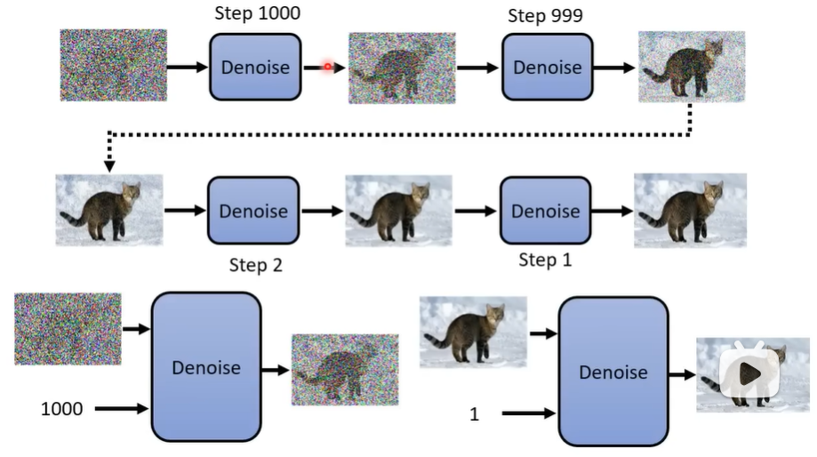

<center>diffusion流程</center>

每层去掉一部分噪音，直到最后得到清晰图片。注意每层去掉的噪音量不同，越靠后噪音越少，所以每层除了输入带噪音的图片，还要输入一个递减的数字（denoise序号），大致表示噪音量。

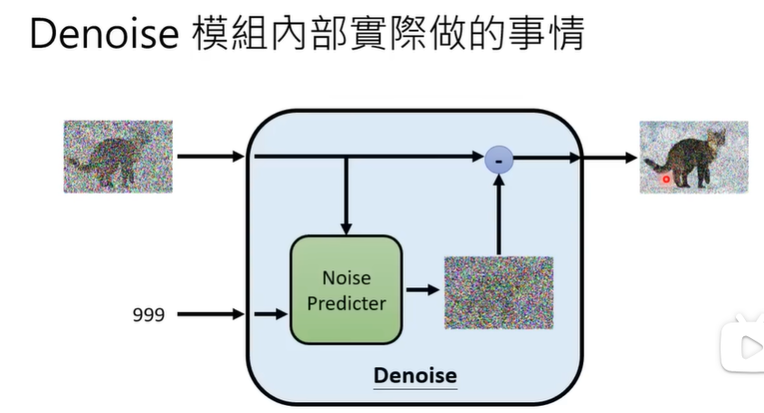

<center>每层denoise内部结构</center>

图片和denoise序号送入一个noise predicter，产生预测的噪声，再用图片减去预测的噪声，得到denoise后更清晰的图片。

> 为什么不直接预测去噪后的图片？
>
> 可以这么做，但这两种生成的难度是不同的。预测噪声要简单一点。

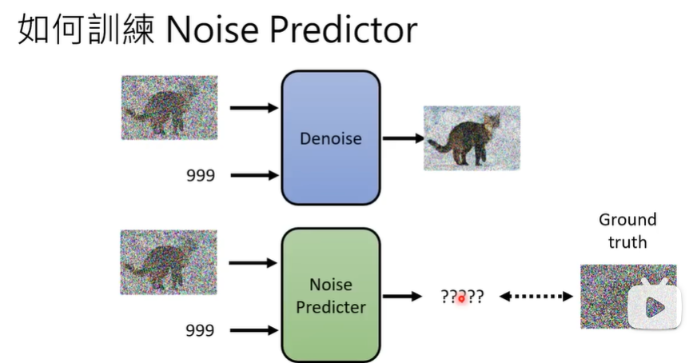

<center>构想的训练方式</center>

要训练noise predicter识别出噪声，我们需要告诉noise predicter，输入图片的噪声。这个噪声实际是我们自己制造的。

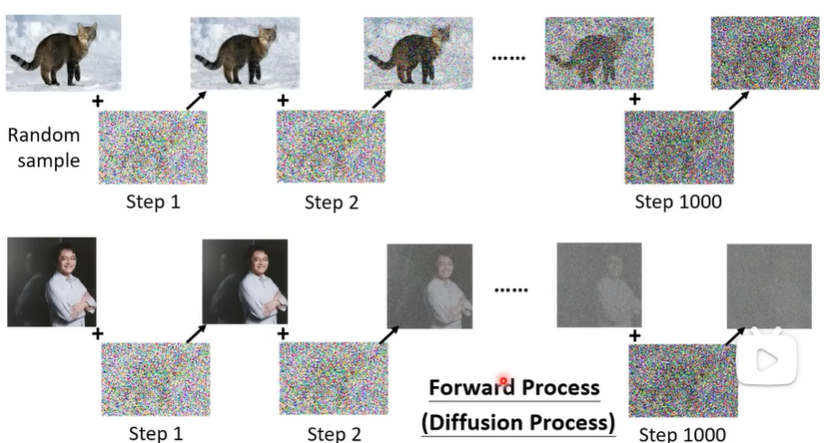

<center>图片加噪声过程</center>

这个加噪声的过程，被称为前向处理，或者扩散处理。这样就得到denoise predicter的训练资料。

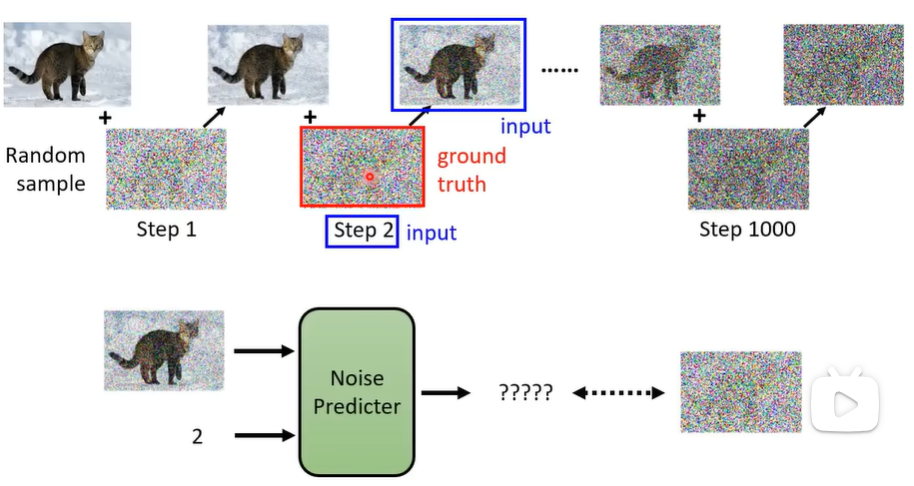

<center>得到训练资料并用作训练</center>

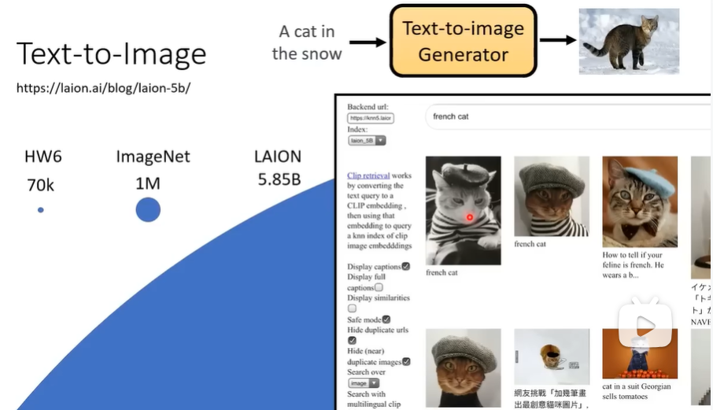

<center>常见的text to image数据库</center>

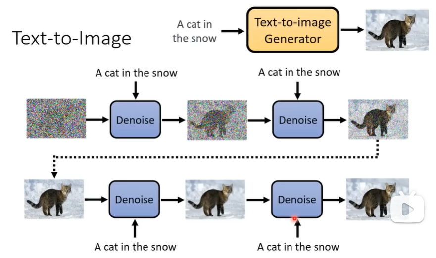

<center>text to image过程</center>

文生图的过程，一段用户输入的文字加一个模型自己生成的随机噪声图片。经过不断的denoise过程，就可得到文字描述需要的清晰图片。

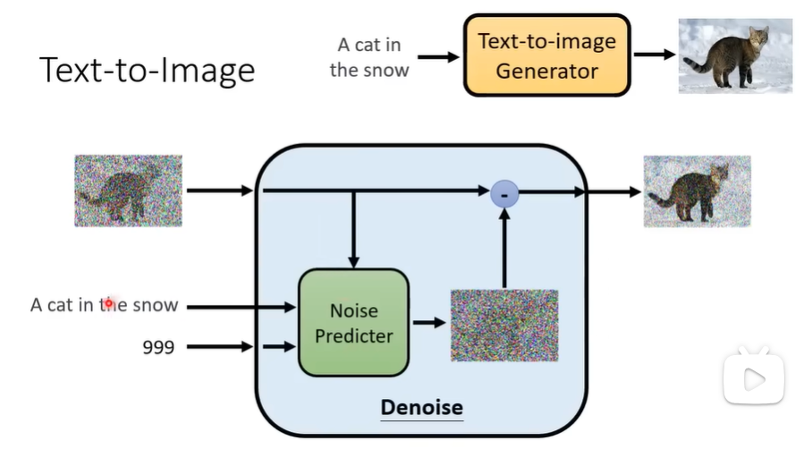

<center>denoise内部结构</center>

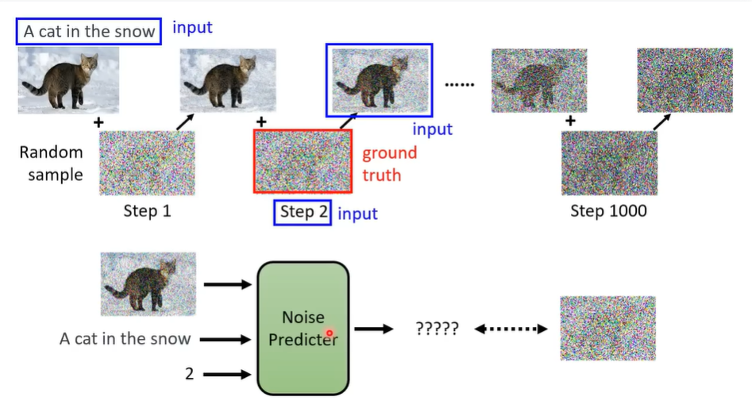

<center>加入文字描述并得到训练资料</center>

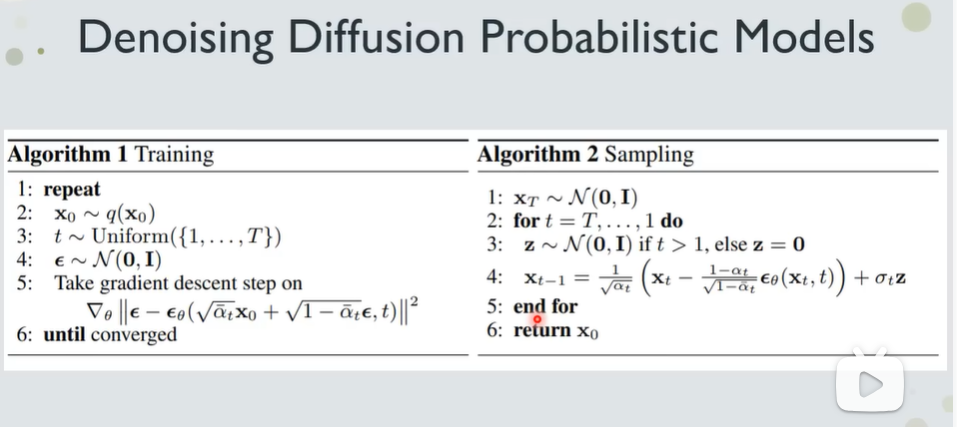

<center>算法流程</center>


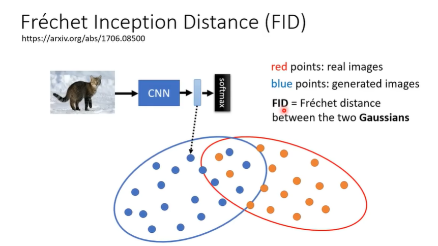

<center>判断生成图像质量的指标</center>

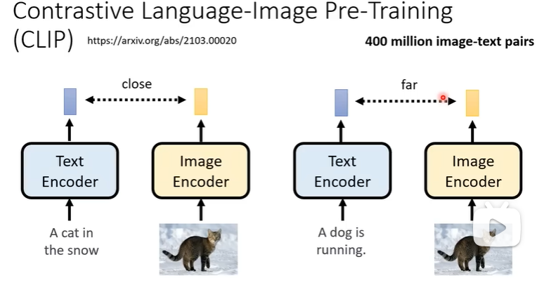


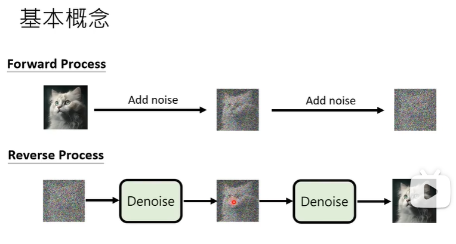

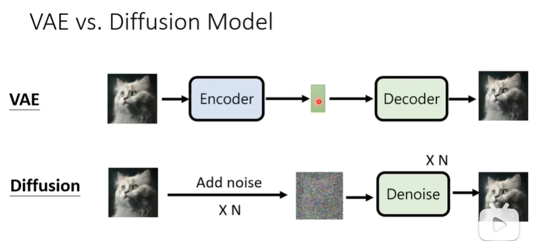

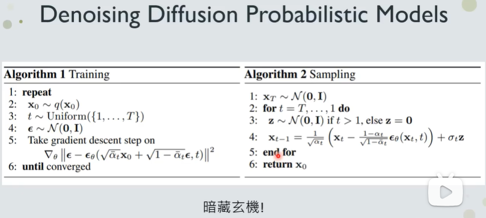

$\alpha_t$ 是一个预定义的衰减系数，控制了在时间步 $t$ 时添加噪声的比例。$\epsilon$ 是从标准高斯分布 $\mathcal{N}(0, 1)$ 中采样得到的噪声向量。通常，$\alpha_t$  随着时间步 $t$ 的增加而逐渐减小，这意味着在早期时间步添加的噪声较少，而在后期时间步添加的噪声较多。


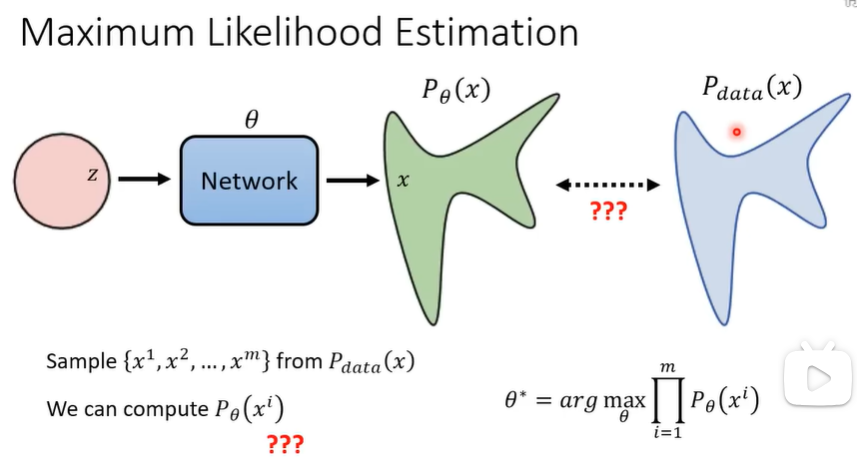


# 模型


<center>UNet</center>

在训练中，给原始图像直接一步加上任意t步的噪声，然后让UNet来预测这个噪声，通过真实噪声和预测噪声来计算损失训练模型。

在推理中，原始图像为纯高斯噪声。通过UNet从T到1预测T次噪声。通过预测的噪声计算后验分布作为正态分布的均值和方差，从后验分布中随机取出一个噪声，用 $x_t$ 加或减这个噪声，得到 $x_{t-1}$ 。重复T次，得到推理的干净图像。


# 代码

```python
import torch
import torch.nn as nn
import torch.optim as optim
import torchvision
import torchvision.transforms as transforms
from torch.utils.data import DataLoader
from tqdm import tqdm
import matplotlib.pyplot as plt
import math
from typing import Optional, Tuple, Union, List
import os
# 设置环境变量，允许OpenMP运行时重复初始化，解决"libiomp5md.dll already initialized"报错
os.environ["KMP_DUPLICATE_LIB_OK"] = "TRUE"

# -------------------------- 1. 核心配置 --------------------------
DEVICE = torch.device("cuda" if torch.cuda.is_available() else "cpu")
print(f"使用设备：{DEVICE}")

# 扩散过程参数
T = 1000
BETA_START = 1e-5
BETA_END = 0.02

# 模型参数（通道数均为32整数倍，避免GroupNorm报错）
IMG_SIZE = 32
IN_CHANNELS = 1  # MNIST灰度图，通道数1
MODEL_CHANNELS = 64  # 基础通道数，32的2倍，确保GroupNorm分组32合法
N_GROUPS = 32  # GroupNorm分组数，固定32
LEARNING_RATE = 1e-4
BATCH_SIZE = 64  # 适配RTX 3060/6GB显存
EPOCHS = 20
SAVE_BEST_PATH = "ddpm_mnist_best.pth"

# 数据预处理（官方推荐，归一化到[-1, 1]）
transform = transforms.Compose([
    transforms.Resize((IMG_SIZE, IMG_SIZE)),
    transforms.ToTensor(),
    transforms.Normalize((0.5,), (0.5,))
])

# -------------------------- 2. 预计算扩散核心参数（官方闭式解） --------------------------
betas = torch.linspace(BETA_START, BETA_END, T, device=DEVICE)
alphas = 1.0 - betas
alphas_cumprod = torch.cumprod(alphas, dim=0)
alphas_cumprod_prev = torch.cat([torch.ones(1, device=DEVICE), alphas_cumprod[:-1]])
sqrt_alphas_cumprod = torch.sqrt(alphas_cumprod)
sqrt_one_minus_alphas_cumprod = torch.sqrt(torch.clamp(1.0 - alphas_cumprod, 1e-8, 1.0))
sqrt_recip_alphas = torch.sqrt(1.0 / alphas)
posterior_variance = betas * (1.0 - alphas_cumprod_prev) / (1.0 - alphas_cumprod)
posterior_variance = torch.clamp(posterior_variance, min=1e-20)  # 官方数值稳定技巧


def forward_diffusion_sample(x0, t, noise=None):
    """DDPM官方前向扩散公式"""
    batch_size = x0.shape[0]
    if noise is None:
        noise = torch.randn_like(x0, device=DEVICE)

    sqrt_alphas_cumprod_t = sqrt_alphas_cumprod[t].view(batch_size, 1, 1, 1)
    sqrt_one_minus_alphas_cumprod_t = sqrt_one_minus_alphas_cumprod[t].view(batch_size, 1, 1, 1)

    xt = sqrt_alphas_cumprod_t * x0 + sqrt_one_minus_alphas_cumprod_t * noise
    return xt, noise


# -------------------------- 3. DDPM核心模块 --------------------------
class Swish(nn.Module):
    """扩散模型常用激活函数"""

    def forward(self, x: torch.Tensor) -> torch.Tensor:
        return x * torch.sigmoid(x)


class TimeEmbedding(nn.Module):
    """时间步嵌入：将一维t转换为高维特征"""

    def __init__(self, dim: int):
        super().__init__()
        self.dim = dim
        # 预计算频率编码
        self.freqs = nn.Parameter(torch.randn(dim // 2) * math.pi, requires_grad=False)
        self.linear_seq = nn.Sequential(
            nn.Linear(self.dim, self.dim * 4),
            Swish(),
            nn.Linear(self.dim * 4, self.dim * 4)
        )

    def forward(self, t: torch.Tensor) -> torch.Tensor:
        # t: [batch_size] -> [batch_size, 1]
        t = t.unsqueeze(-1)
        # 频率编码：sin/cos 编码
        emb = t * self.freqs.unsqueeze(0)  # [batch_size, dim//2]
        emb = torch.cat([torch.sin(emb), torch.cos(emb)], dim=-1)  # [batch_size, dim]
        # 两层全连接提升表达
        emb = self.linear_seq(emb)
        return emb  # [batch_size, dim*4]


class ResidualBlock(nn.Module):
    """
    ### Residual block

    A residual block has two convolution layers with group normalization.
    Each resolution is processed with two residual blocks.
    """

    def __init__(self, in_channels: int, out_channels: int, time_channels: int,
                 n_groups: int = 32, dropout: float = 0.1):
        """
        * `in_channels` is the number of input channels
        * `out_channels` is the number of input channels
        * `time_channels` is the number channels in the time step ($t$) embeddings
        * `n_groups` is the number of groups for [group normalization](../../normalization/group_norm/index.html)
        * `dropout` is the dropout rate
        """
        super().__init__()
        # Group normalization and the first convolution layer
        self.norm1 = nn.GroupNorm(n_groups, in_channels)
        self.act1 = Swish()
        self.conv1 = nn.Conv2d(in_channels, out_channels, kernel_size=(3, 3), padding=(1, 1))

        # Group normalization and the second convolution layer
        self.norm2 = nn.GroupNorm(n_groups, out_channels)
        self.act2 = Swish()
        self.conv2 = nn.Conv2d(out_channels, out_channels, kernel_size=(3, 3), padding=(1, 1))

        # If the number of input channels is not equal to the number of output channels we have to
        # project the shortcut connection
        if in_channels != out_channels:
            self.shortcut = nn.Conv2d(in_channels, out_channels, kernel_size=(1, 1))
        else:
            self.shortcut = nn.Identity()

        # Linear layer for time embeddings
        self.time_emb = nn.Linear(time_channels, out_channels)
        self.time_act = Swish()

        self.dropout = nn.Dropout(dropout)

    def forward(self, x: torch.Tensor, t: torch.Tensor):
        """
        * `x` has shape `[batch_size, in_channels, height, width]`
        * `t` has shape `[batch_size, time_channels]`
        """
        # First convolution layer
        h = self.conv1(self.act1(self.norm1(x)))
        # Add time embeddings
        h += self.time_emb(self.time_act(t))[:, :, None, None]
        # Second convolution layer
        h = self.conv2(self.dropout(self.act2(self.norm2(h))))

        # Add the shortcut connection and return
        return h + self.shortcut(x)


class DownBlock(nn.Module):
    """下采样残差块（带注意力）"""

    def __init__(self, in_channels: int, out_channels: int, time_channels: int, use_attn: bool):
        super().__init__()
        self.res = ResidualBlock(in_channels, out_channels, time_channels)
        # 注意力层（可选）
        self.attn = nn.MultiheadAttention(out_channels, 8, batch_first=True) if use_attn else None

    def forward(self, x: torch.Tensor, t: torch.Tensor) -> torch.Tensor:
        x = self.res(x, t)
        # 注意力（可选）
        if self.attn is not None:
            B, C, H, W = x.shape
            x_flat = x.permute(0, 2, 3, 1).reshape(B, H * W, C)  # [B, H*W, C]
            x_attn, _ = self.attn(x_flat, x_flat, x_flat)
            x = x_attn.reshape(B, H, W, C).permute(0, 3, 1, 2)  # [B,C,H,W]
        return x


class UpBlock(nn.Module):
    """上采样残差块（带注意力）"""

    def __init__(self, in_channels: int, out_channels: int, time_channels: int, use_attn: bool):
        super().__init__()
        # The input has `in_channels + out_channels` because we concatenate the output of the same resolution
        # from the first half of the U-Net
        self.res = ResidualBlock(in_channels + out_channels, out_channels, time_channels)
        self.attn = nn.MultiheadAttention(out_channels, 8, batch_first=True) if use_attn else None

    def forward(self, x: torch.Tensor, t: torch.Tensor) -> torch.Tensor:
        x = self.res(x, t)
        if self.attn is not None:
            B, C, H, W = x.shape
            x_flat = x.permute(0, 2, 3, 1).reshape(B, H * W, C)
            x_attn, _ = self.attn(x_flat, x_flat, x_flat)
            x = x_attn.reshape(B, H, W, C).permute(0, 3, 1, 2)
        return x


class MiddleBlock(nn.Module):
    """U-Net瓶颈层（带注意力）"""

    def __init__(self, channels: int, time_emb_dim: int):
        super().__init__()
        self.conv1 = DownBlock(channels, channels, time_emb_dim, use_attn=True)
        self.conv2 = DownBlock(channels, channels, time_emb_dim, use_attn=True)

    def forward(self, x: torch.Tensor, t: torch.Tensor) -> torch.Tensor:
        x = self.conv1(x, t)
        x = self.conv2(x, t)
        return x


class Downsample(nn.Module):
    """下采样：步长2的卷积（替代最大池化）"""

    def __init__(self, channels: int):
        super().__init__()
        self.conv = nn.Conv2d(channels, channels, kernel_size=3, stride=2, padding=1)

    def forward(self, x: torch.Tensor, t: Optional[torch.Tensor] = None) -> torch.Tensor:
        return self.conv(x)


class Upsample(nn.Module):
    """上采样：转置卷积"""

    def __init__(self, channels: int):
        super().__init__()
        self.conv = nn.ConvTranspose2d(channels, channels, kernel_size=4, stride=2, padding=1)

    def forward(self, x: torch.Tensor, t: Optional[torch.Tensor] = None) -> torch.Tensor:
        return self.conv(x)


# -------------------------- 扩散版U-Net主类 --------------------------
class UNet(nn.Module):
    """DDPM中的U-Net（对应参考代码）"""

    def __init__(self,
                 image_channels: int = 3,
                 n_channels: int = 64,
                 ch_mults: Union[Tuple[int, ...], List[int]] = (1, 2, 2, 4),
                 is_attn: Union[Tuple[bool, ...], List[bool]] = (False, False, True, True),
                 n_blocks: int = 2):
        super().__init__()
        # 1. 图像投影（将输入图像转为初始特征图）
        self.image_proj = nn.Conv2d(image_channels, n_channels, kernel_size=3, padding=1)

        # 2. 时间步嵌入层
        self.time_emb = TimeEmbedding(n_channels)

        # 3. 下采样路径（分辨率降低）
        down = []
        in_channels = out_channels = n_channels
        n_resolutions = len(ch_mults)
        for i in range(n_resolutions):
            # 当前分辨率的输出通道数
            out_channels = in_channels * ch_mults[i]
            # 添加n_blocks个残差块
            for _ in range(n_blocks):
                down.append(DownBlock(in_channels, out_channels, n_channels * 4, is_attn[i]))
                in_channels = out_channels
            # 最后一个分辨率不下采样
            if i < n_resolutions - 1:
                down.append(Downsample(in_channels))
        self.down = nn.ModuleList(down)

        # 4. 瓶颈层
        self.middle = MiddleBlock(out_channels, n_channels * 4)

        # 5. 上采样路径（分辨率提升）
        up = []
        in_channels = out_channels
        for i in reversed(range(n_resolutions)):
            out_channels = in_channels
            # 添加n_blocks个残差块
            for _ in range(n_blocks):
                up.append(UpBlock(in_channels, out_channels, n_channels * 4, is_attn[i]))
            # 调整通道数（与下采样对应）
            out_channels = in_channels // ch_mults[i]
            up.append(UpBlock(in_channels , out_channels, n_channels * 4, is_attn[i]))
            in_channels = out_channels
            # 第一个分辨率不上采样
            if i > 0:
                up.append(Upsample(in_channels))
        self.up = nn.ModuleList(up)

        # 6. 最终输出层
        self.norm = nn.GroupNorm(8, n_channels)
        self.act = Swish()
        self.final = nn.Conv2d(in_channels, image_channels, kernel_size=3, padding=1)

    def forward(self, x: torch.Tensor, t: torch.Tensor) -> torch.Tensor:
        # x: [B, C, H, W]（图像）, t: [B]（扩散步数）
        # 1. 时间步嵌入
        t_emb = self.time_emb(t)  # [B, n_channels*4]
        # 2. 图像投影
        # [b, 1, 32, 32] -> [b, 64, 32, 32]
        x = self.image_proj(x)  # [B, n_channels, H, W]
        # 3. 保存跳连特征
        skip_features = [x]
        # 4. 下采样路径
        # 8 DownBlocks, 3 DownSamples
        # [b, 64, 32, 32] -> [b, 1024, 4, 4]
        for m in self.down:
            x = m(x, t_emb)
            skip_features.append(x)
        # 5. 瓶颈层
        x = self.middle(x, t_emb)
        # 6. 上采样路径（拼接跳连特征）
        # 12 UpBlocks, 3 UpSamples
        # [b, 1024, 4, 4] -> [b, 64, 32, 32]
        for m in self.up:
            if isinstance(m, Upsample):
                x = m(x, t_emb)
            else:
                # 取出下采样的跳连特征并拼接
                skip_x = skip_features.pop()
                x = torch.cat([x, skip_x], dim=1)
                x = m(x, t_emb)
        # 7. 最终输出
        x = self.final(self.act(self.norm(x)))
        return x


# -------------------------- 4. 训练与验证 --------------------------
def train_one_epoch(model, dataloader, optimizer, epoch):
    model.train()
    total_loss = 0.0
    pbar = tqdm(dataloader, desc=f"Epoch {epoch + 1}/{EPOCHS} [Train]")

    for batch in pbar:
        x0 = batch[0].to(DEVICE)
        batch_size = x0.shape[0]

        # 1. 随机采样时间步t
        # 不是照论文标准步骤那样，从1到T逐渐递增地加噪，而是从1到T之间随机采样一个t，对每个样本，直接算x0到这个t的加噪的噪声和去噪的噪声，两个噪声来计算损失训练模型。
        t = torch.randint(0, T, (batch_size,), device=DEVICE, dtype=torch.long)

        # 2. 前向扩散生成xt和真实噪声
        xt, true_noise = forward_diffusion_sample(x0, t)

        # 3. 模型预测噪声
        noise_pred = model(xt, t)
        torch.clamp(noise_pred,  -5.0, 5.0)

        # 检查NaN
        if torch.isnan(noise_pred).any():
            print(f"⚠️ 检测到NaN: epoch {epoch}, labels {batch[1]}")
            print(f"t范围: {t.min().item()} - {t.max().item()}")
            print(f"xt范围: {xt.min().item():.6f} - {xt.max().item():.6f}")
            continue  # 跳过有问题的batch

        # 4. 损失函数：MSE(预测噪声, 真实噪声)
        loss = nn.functional.mse_loss(noise_pred, true_noise)

        if torch.isnan(loss):
            print(f"❌ 损失为NaN，跳过该batch")
            continue

        # 5. 反向传播与优化（加入梯度裁剪）
        optimizer.zero_grad()
        loss.backward()

        # 检查梯度NaN
        grad_nan = False
        for name, param in model.named_parameters():
            if param.grad is not None and torch.isnan(param.grad).any():
                print(f"梯度NaN: {name}")
                grad_nan = True
                break

        if grad_nan:
            optimizer.zero_grad()
            continue

        nn.utils.clip_grad_norm_(model.parameters(), 1.0)
        optimizer.step()

        # 6. 统计损失
        total_loss += loss.item() * batch_size
        avg_loss = total_loss / ((pbar.n + 1) * batch_size)
        pbar.set_postfix({"Train Avg Loss": f"{avg_loss:.6f}"})

    return total_loss / len(dataloader.dataset)


def validate(model, dataloader):
    model.eval()
    total_val_loss = 0.0

    with torch.no_grad():  # 禁用梯度，节省显存
        pbar = tqdm(dataloader, desc="Validation")
        for batch in pbar:
            x0 = batch[0].to(DEVICE)
            batch_size = x0.shape[0]

            t = torch.randint(0, T, (batch_size,), device=DEVICE, dtype=torch.long)
            xt, true_noise = forward_diffusion_sample(x0, t)
            noise_pred = model(xt, t)

            loss = nn.functional.mse_loss(noise_pred, true_noise)
            total_val_loss += loss.item() * batch_size

            avg_val_loss = total_val_loss / ((pbar.n + 1) * batch_size)
            pbar.set_postfix({"Val Avg Loss": f"{avg_val_loss:.6f}"})

    return total_val_loss / len(dataloader.dataset)


# -------------------------- 5. 反向扩散采样 --------------------------
@torch.no_grad()
def sample(model, num_samples=16):
    """DDPM反向扩散采样，从纯噪声x_T到清晰图像x_0"""
    model.eval()

    # 1. 初始化x_T为纯高斯噪声
    x = torch.randn((num_samples, IN_CHANNELS, IMG_SIZE, IMG_SIZE), device=DEVICE)

    # 2. 逐步反向去噪（从T-1到0）
    pbar = tqdm(range(T - 1, -1, -1), desc="Reverse Diffusion Sampling")
    for t in pbar:
        batch_size = x.shape[0]
        t_tensor = torch.full((batch_size,), t, device=DEVICE, dtype=torch.long)

        # 3. 模型预测噪声
        noise_pred = model(x, t_tensor)
        torch.clamp(noise_pred, -5.0, 5.0)

        # 4. 提取预计算参数
        sqrt_recip_alphas_t = sqrt_recip_alphas[t_tensor].view(batch_size, 1, 1, 1)
        betas_t = betas[t_tensor].view(batch_size, 1, 1, 1)
        sqrt_one_minus_alphas_cumprod_t = sqrt_one_minus_alphas_cumprod[t_tensor].view(batch_size, 1, 1, 1)
        posterior_variance_t = posterior_variance[t_tensor].view(batch_size, 1, 1, 1)

        # 5. 计算x_{t-1}
        x_prev_mean = sqrt_recip_alphas_t * (
                x - (betas_t / sqrt_one_minus_alphas_cumprod_t) * noise_pred
        )

        # 6. 添加噪声
        if t > 0:
            z = torch.randn_like(x, device=DEVICE)
            x_prev = x_prev_mean + torch.sqrt(posterior_variance_t) * z
        else:
            x_prev = x_prev_mean

        # 7. 裁剪到[-1, 1]，避免数值发散
        x = x_prev.clamp(-1.0, 1.0)

    # 8. 转换为[0, 1]区间，方便可视化
    x = (x + 1) / 2.0
    x = torch.clamp(x, 0.0, 1.0)

    return x


# -------------------------- 6. 模型保存/加载与可视化--------------------------
def save_best_model(model, optimizer, best_val_loss, best_epoch, path):
    checkpoint = {
        "model_state_dict": model.state_dict(),
        "optimizer_state_dict": optimizer.state_dict(),
        "best_val_loss": best_val_loss,
        "best_epoch": best_epoch,
        "T": T,
        "IMG_SIZE": IMG_SIZE
    }
    torch.save(checkpoint, path)
    print(f"✅ 最佳模型已保存至 {path}（第{best_epoch}轮，验证损失：{best_val_loss:.6f}）")


def load_best_model(model, path):
    try:
        checkpoint = torch.load(path, map_location=DEVICE)
        model.load_state_dict(checkpoint["model_state_dict"])
        best_val_loss = checkpoint["best_val_loss"]
        best_epoch = checkpoint["best_epoch"]
        print(f"✅ 成功加载最佳模型（第{best_epoch}轮，验证损失：{best_val_loss:.6f}）")
        return model
    except FileNotFoundError:
        raise Exception(f"未找到模型文件：{path}，请先完成训练")


def visualize_generated_samples(samples):
    """可视化生成结果，保存到本地"""
    num_rows = 4
    num_cols = samples.shape[0] // num_rows

    fig, axes = plt.subplots(num_rows, num_cols, figsize=(num_cols * 2, num_rows * 2))
    for i, img in enumerate(samples):
        row = i // num_cols
        col = i % num_cols

        img_np = img.squeeze().cpu().detach().numpy()
        axes[row, col].imshow(img_np, cmap="gray")
        axes[row, col].axis("off")

    plt.tight_layout()
    plt.savefig("ddpm_mnist_generated.png")
    plt.show()


# -------------------------- 7. 主函数（完整流程，可直接运行） --------------------------
def main():
    # 1. 加载MNIST数据集（小数据集，快速验证）
    full_dataset = torchvision.datasets.MNIST(
        root="./data", train=True, download=True, transform=transform
    )

    # 2. 拆分训练集/验证集（9:1）
    val_size = int(0.1 * len(full_dataset))
    train_size = len(full_dataset) - val_size
    train_dataset, val_dataset = torch.utils.data.random_split(full_dataset, [train_size, val_size])

    # train_dataloader = DataLoader(train_dataset, batch_size=BATCH_SIZE, shuffle=True, num_workers=2)
    # val_dataloader = DataLoader(val_dataset, batch_size=BATCH_SIZE, shuffle=False, num_workers=2)
    # Windows用多线程会报错
    train_dataloader = DataLoader(train_dataset, batch_size=BATCH_SIZE, shuffle=True)
    val_dataloader = DataLoader(val_dataset, batch_size=BATCH_SIZE, shuffle=False)

    # 3. 初始化模型和优化器
    model = UNet(
        image_channels=1,   # mnist单通道
    ).to(DEVICE)
    optimizer = optim.AdamW(model.parameters(), lr=LEARNING_RATE, betas=(0.9, 0.999))
    print(f"模型参数总量：{sum(p.numel() for p in model.parameters()):,}")

    # 4. 训练循环（保存最佳模型）
    best_val_loss = float("inf")
    best_epoch = 0

    print("\n=== 开始训练DDPM===")
    for epoch in range(EPOCHS):
        train_loss = train_one_epoch(model, train_dataloader, optimizer, epoch)
        val_loss = validate(model, val_dataloader)

        print(f"\n=== Epoch {epoch + 1} Summary ===")
        print(f"Train Loss: {train_loss:.6f} | Val Loss: {val_loss:.6f}")

        # 保存最佳模型
        if val_loss < best_val_loss:
            best_val_loss = val_loss
            best_epoch = epoch + 1
            save_best_model(model, optimizer, best_val_loss, best_epoch, SAVE_BEST_PATH)

    # 5. 加载最佳模型并生成图像
    print("\n=== 开始生成清晰图像 ===")
    model = load_best_model(model, SAVE_BEST_PATH)
    generated_samples = sample(model, num_samples=16)
    visualize_generated_samples(generated_samples)


if __name__ == "__main__":
    main()

```


# 参考

[ https://doi.org/10.48550/arXiv.2006.11239](https://doi.org/10.48550/arXiv.2006.11239)https://doi.org/10.48550/arXiv.2006.11239)

[DDPM · GitHub](https://github.com/labmlai/annotated_deep_learning_paper_implementations/blob/master/labml_nn/diffusion/ddpm/unet.py)

[深入浅出扩散模型(Diffusion Model)系列：基石DDPM（源码解读篇） - 知乎](https://zhuanlan.zhihu.com/p/655568910#:~:text=终于来到扩散模型DDPM系列的最后一篇：源码解读了。本文将配合详细的图例，来为大家解读DDPM的模型架构与训练方式的代码实现。)

[扩散模型 - Diffusion Model【李宏毅2023】](https://www.bilibili.com/video/BV14c411J7f2/?spm_id_from=333.337.search-card.all.click&vd_source=6d7dc2c06bc4259ac0e431a2824dbf9d)

