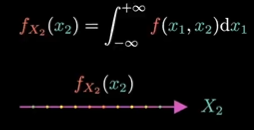
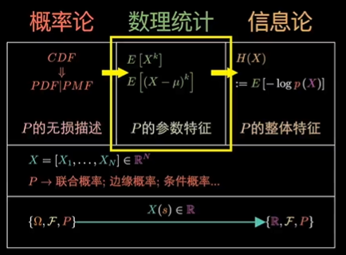

设 $f(t)$ 为概率**密度**函数，则 $f(t)$ 的积分称为**质量**，即**一条线段上的权重**， $F(x) = \int^x_{-∞}f(t)\text{d}t$ 称为概率**质量**函数，或**累积分布**函数，或直接称**分布**。

对二维概率密度空间，累积分布函数为 $F(x_1, x_2) = \int_{-∞}^{x_1}\int_{-∞}^{x_2}f(x_1, x_2)\text{d}x_1\text{d}x_2$ ， $f(x_1, x_2)$ 称为**联合**概率密度函数。

在高维的基础上，不只可以考虑高维的问题，还可以在其基础上，考虑低维问题。即**边缘概率**和**条件概率**。

* **边缘概率**

  **边缘分布**，是在多维随机变量中，**只关注其中某一个随机变量，将其他所有变量的影响 “积分 / 求和” 消去**，得到的单个变量的概率分布。

  把 $(x_1, x_2)$ 二维空间的点，**拍平**到 $x_2$ 轴上，这样自变量就从二维空间变成了一维空间，三维的联合概率密度函数 $f(x_1, x_2)$ 就变成了二维的概率密度函数 $f_{X_2}(x_2)$ 。并且，由于原来的概率质量归一，现在的**概率质量也是归一**。

  边缘概率**密度**函数 $f_{X_2}(x_2) = \int_{-∞}^{+∞}f(x_1, x_2)\text{d}x_1$ 

  边缘概率**质量**函数 $F_{X_2}(x_2) = \int_{-∞}^{x_2}f_{X_2}(x2) \text{d}x_2 = \int_{-∞}^{x_2}\int_{-∞}^{+∞}f(x_1, x_2)\text{d}x_1\text{d}x_2$

* **条件概率**

  **条件分布**，是已知**其中一个随机变量取某个固定值**的前提下，另一个随机变量的概率分布。它是**经典条件概率 P(A|B)** 在多维随机变量上的直接推广，用来描述 “限定条件下” 的概率规律。

  条件概率也是自变量从二维空间变为一维空间，区别是没有拍平压缩的过程，只是固定了一个自变量，所以其**概率质量没有归一**。

  条件概率**密度**函数 $f_{X_1 | X_2} (x_1, x_2) = \frac{f(x_1, x_2)} {f_{X_2}(x_2)}$

  条件概率**质量**函数 $F_{X_2}(x_2) = \int_{-∞}^{x_2}f_{X_1|X_2}(x_1, x_2)\text{d}x_2$

**独立性**：

变量**独立** <=> 多维随机变量的**联合分布 = 边缘分布的乘积**

$f(x_1, x_2) = f_{X_1}(x_1) f_{X_2}(x_2)$

变量独立时，**条件分布 = 边缘分布**：
$$
f_{X_1 | X_2} (x_1 | x_2) 
\\= \frac{f(x_1, x_2)} {f_{X_2}(x_2)} 
\\= \frac{f_{X_1}(x_1)f_{X_2}(x_2)} {f_{X_2}(x_2)} 
\\= f_{X_1}(x_1)
$$
结合条件分布和边缘分布，直接得到**连续型贝叶斯公式**，这是深度学习贝叶斯推断的核心公式：
$$
f_{Y|X}(y|x) = \frac{f_{X|Y}(x|y) f_Y(y)} {f_X(x)}
$$

- $f_Y(y)$：先验分布
- $f_{X|Y}(x∣y)$：似然
- $f_X(x)$：证据
- $f_{Y|X}(y|x)$：后验分布

比如对VAE，我们知道隐变量 $y$ 的先验分布（标准正态分布）$f_Y(y)$ ，想求样本分布 $f_X(x)$ ，所以只要限制 后验分布 $f_{Y|X}(y|x)$  = 先验分布 $f_Y(y)$ ，就可以确定似然分布 $f_{X|Y}(x|y)$ = 证据 $x$ 的分布 $f_X(x)$ 。即，我们按照标准正态分布的概率抽样一个 $y$，由这个 $y$ 生成一个样本 $x$ ，那么抽到这个 $y$ 的概率就是真实世界抽到 $x$ 的概率。

