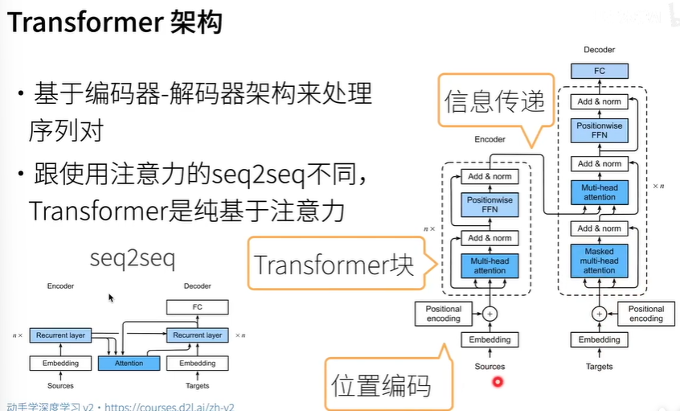
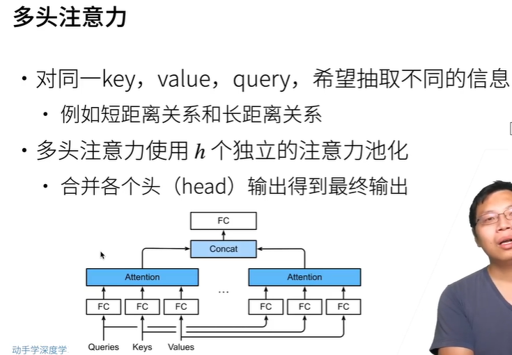
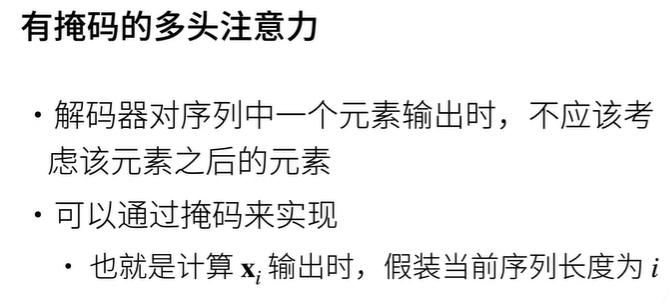
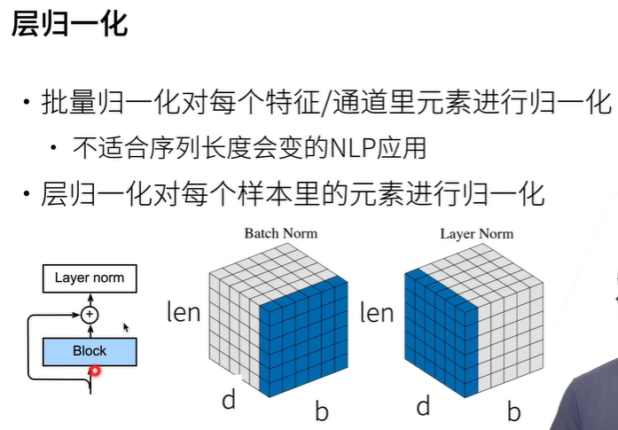
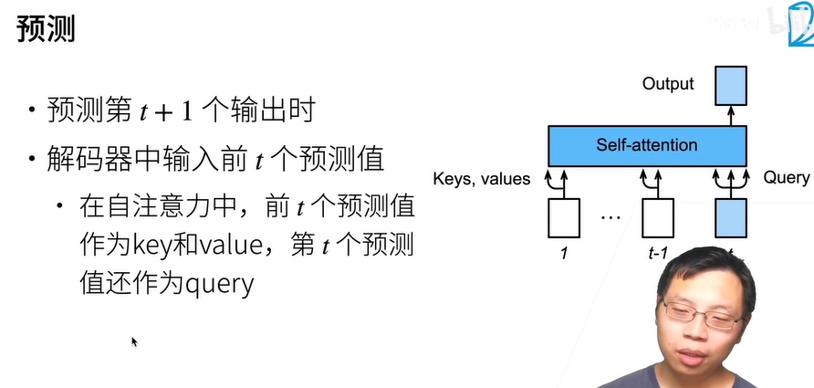

# 一、介绍


## 1. 架构









编码器可以双向考虑，从未来看过去，但解码器不行。

解码器的注意力层需要增加掩码考虑，因为生成序列，不能先看未来，再生成过去。


## 2. 位置编码

$PE(pos, 2i) = sin(pos / 10000^(2i/d_{model}))$
$PE(pos, 2i+1) = cos(pos / 10000^(2i/d_{model}))$


$sin(\alpha\pm \beta) = sin\alpha × cos\beta \pm cos\alpha × sin\beta$

$cos(\alpha \pm \beta) = cos\alpha × cos\beta \mp sin\alpha × sin\beta$

=>

$PE_{pos + k, 2i} \\= sin((pos + k) / 10000^{2i/d_{model}}) \\= sin(pos / 10000^{2i/d_{model}}) × cos (k / 10000^{2i/d_{model}}) + cos(pos / 10000^{2i/d_{model}}) × sin(k / 10000^{2i/d_{model}})$

$PE_{pos + k, 2i + 1} \\= cos((pos + k) / 10000^{2i / d_{model}})$


其中$d_{model}$是位置编码的维度，它通常和模型中词向量的维度相同，这样方便后续的相加操作；$pos$表示序列中的位置索引，从$0$开始； $i$ 表示维度索引，从$0$到 $d-1$ 。


## 3. 层归一化



batch_norm：把输入的图像数据，按每个batch的所有元素，在一个通道上。或者是把输入的序列数据，按每个batch的所有元素，在一个特征维度上（在d中的某一维)。把这里面的数据，方差变1，均值变0。如左图所包含的数据（batch×len)。

batch norm是把一个batch内所有句子所有词的某个特征维度进行正则化，layer norm是把一个batch内一个句子所有词的所有特征维度进行正则化。

如果对序列数据用batch_norm，而且序列的len是会变的，那就导致batch_norm不稳定。

以下举例BN，batch行，len列，padding 0：

> 2, 4, 0, 0
>
> 1, 3, 5, 0

计算得到均值和方差后，对每个元素减去均值再除以根号方差，将整体分布变为均值0方差1，这就会导致padding位置变为非0。

以下举例LN，d行，len列，padding 0：

> 1, 2, 0, 0
>
> 3, 4, 0, 0

因为LN是处理的单位是一个句子，所以padding的位置在相同的列，所以我们忽略padding的列，处理其余元素即可，这样padding的位置输出后还是0，不会影响整体分布。


## 4. QKV

- **Q（Query）**：“查询词”—— 我现在需要什么信息？
- **K（Key）**：“字典的索引”—— 可供查询的信息有哪些标签？与 Q（Query）计算相似度（注意力分数），决定 “关注哪些位置”；
- **V（Value）**：“字典的内容”—— 对应标签的具体信息是什么？根据注意力分数进行加权求和，提供 “被关注位置的具体信息”。

encoder负责理解源序列，decoder负责生成目标序列。


K和V是否必须相同：

不一定。

* CLIP：文本与图像的语义匹配
  - 图像特征被拆分为多个区域特征（如 16×16 的图像块），作为**K（图像区域的 “索引特征”）**；
  - 文本序列（如 “a cat sitting on a mat”）的特征作为**V（文本的 “语义内容”）**；
  - Q 来自文本序列的查询（如 “cat” 对应的特征），通过匹配图像 K 找到相关区域，再用文本 V 增强匹配分数。
* 推荐系统：需要根据 “用户历史行为” 和 “物品特征” 预测用户对新物品的偏好，例如用户u的历史行为序列为 $[i_1, i_2, ..., i_n]$ （物品），需预测对物品 $i_{n+1}$ 的兴趣
  - K 来自**物品的 “属性特征”**（如物品类别、价格等，用于快速匹配用户兴趣）；
  - V 来自**用户与物品的 “交互特征”**（如点击次数、停留时间等，用于量化兴趣强度）；
  - Q 来自用户当前的查询特征（如最近浏览的物品），通过 K 找到相似物品，再用 V 计算加权兴趣分数。
* 对话系统：上下文 - 知识注意力，例如用户问 “《三体》的作者是谁？”，对话历史提供上下文，外部知识库提供书籍 - 作者对应关系
  - K 来自**外部知识的 “实体特征”**（如 “《三体》” 的实体向量，用于定位知识）；
  - V 来自**知识的 “属性内容”**（如 “刘慈欣” 的特征，用于生成回答）；
  - Q 来自用户当前问题的特征（如 “作者” 对应的查询），通过 K 找到知识实体，再用 V 提取答案内容。

- **当任务需要 “关注自身序列的内部依赖” 时**（如文本自注意力），K 和 V 通常来自同一序列（但经不同线性变换，数值不同），这是为了利用序列自身的信息；
- **当任务需要 “跨来源 / 跨模态的信息关联” 时**（如文本 - 图像、用户 - 物品），K 和 V 会来自不同来源，分别承担 “索引” 和 “内容” 的角色，以实现不同信息的融合。


## 5. 源-目标语义关联

decoder的编码器-解码器注意力，需要建立源-目标的语义关联。

在《attention is all you need》中：

* encoder输出的y1, y2, ..., yn
* 将其作为decoder中第i个块中多头注意力的k和v，q则是decoder第i层的输入
* 意味着encoder和decoder中块的个数和输出维度都相同

而主流实现，包括huggingFace等，采用简化方式：

* encoder的最终输出，作为decoder所有层的cross attention输入的k和v

 两种方式的比较：

| 特性       | 简化实现 | 原始逐层实现             |
| :--------- | :------- | :----------------------- |
| 实现复杂度 | 简单     | 较复杂                   |
| 内存占用   | 较低     | 较高（需存储所有层输出） |
| 性能差异   | 通常很小 | 理论上可能更好           |
| 主流使用   | 广泛使用 | 较少使用                 |


## 6. 目标形状

tgt形状(b, seq_len)

**训练时**，decoder输入tgt(:, :-1)，即不用输入\<eos>。期望输出的每个词是对应位置输入的词的下一个词。例如对翻译任务，"I am learning."翻译成"我在学习。"，那么encoder输入["\<sos>", "I", "am", "learning", ".", "\<eos>"]，decoder输入["\<sos>", "我", "在", "学习"]，期望decoder输出["我", "在", "学习", "\<eos>"]。损失函数就是decoder实际输出值和期望输出值（tgt[:, 1:）的交叉熵。decode方法只调一次。

**预测时**，decoder每次预测1个词，直到输出\<eos>或达到最大长度。decode方法的输入为tgt，首先tgt=["\<sos>"]，输入decoder，将输出的最后一个词拼接到tgt，重复这个过程。例如第一次tgt输出["我"]，拼接到tgt，得到["\<sos>", "我"]，再输入decode方法，得到["我"， "在"]，重复过程，直到输出["我", "在", "学习", "\<eos>"]。




最长路径O(n)，要走n遍decoder。decoder的mask主要作用在q上，decoder走第一遍时，即生成第一个词，掩码遮q的第1个词之后的位置。生成第二个词时，掩码遮q的第2个词之后的位置，以此类推。


## 7. 掩码

**掩码**的作用是将值为false的元素置为负无穷，让分配注意力分数F.softmax(attn_scores, dim=-1)时，该位置的值趋于0，即该位置对用v来生成新的序列不产生影响。

Transformer里有3种掩码：

* 编码器自注意力，q=k=v=编码器输入，掩码：(b, 1, 1, seq_len)

  ```python
  src_mask = (src != 0).unsqueeze(1).unsqueeze(2)
  ```

* 解码器自注意力，q=k=v=解码器输入，掩码：(1, 1, tgt_len, tgt_len)，左下三角矩阵，对角线和左下三角都为true

  ```python
  tgt_self_mask = torch.tril(torch.ones((tgt_len, tgt_len), device=src.device)).unsqueeze(0).unsqueeze(0).bool()
  ```

* 解码器交叉注意力，q=解码器输入，k=v=编码器输出，掩码：(b, 1, 1, seq_len)，即解码器输入来查询编码器输出的影响

  ```python
  src_mask = (src != 0).unsqueeze(1).unsqueeze(2)
  ```

  


# 二、代码


```python
import torch
import torch.nn as nn
import torch.optim as optim
import torch.nn.functional as F
from torch.utils.data import DataLoader, Dataset
from datasets import load_dataset  # 加载翻译数据集
import spacy  # 分词工具
import numpy as np
import math
from tqdm import tqdm  # 进度条


class PositionalEncoding(nn.Module):
    """位置编码"""

    def __init__(self, embed_dim: int, max_len: int = 5000, dropout: float = 0.1):
        super().__init__()
        self.dropout = nn.Dropout(p=dropout)

        # 初始化位置编码将矩阵(max_len, embed_dim)
        pe = torch.zeros(max_len, embed_dim)
        # 位置索引(0, 1,..., max_len-1)
        # [max_len] -> [max_len, 1]
        position = torch.arange(0, max_len, dtype=torch.float).unsqueeze(1)
        # 角度计算：10000^(2i/embed_dim)
        div_term = torch.exp(torch.arange(0, embed_dim, 2).float() * (-math.log(10000.0) / embed_dim))
        # 偶数维度sin，奇数cos
        pe[:, 0::2] = torch.sin(position * div_term)
        pe[:, 1::2] = torch.cos(position * div_term)

        # 注册为非训练参数，不参与反向传播更新
        self.register_buffer('pe', pe)

    def forward(self, x):
        # x(b, n, d) + self.pe[:x.size(1)](n, d) -> (b, n, d)
        x = x + self.pe[:x.size(1)]  # 加位置编码（只取前n个位置）
        return self.dropout(x)  # 加dropout防过拟合


class MultiHeadAttention(nn.Module):
    """多头自注意力"""

    def __init__(self, embed_dim: int, num_heads: int, dropout: float = 0.1):
        super().__init__()
        assert embed_dim % num_heads == 0  # 嵌入维度必须能被头数整除

        self.embed_dim = embed_dim
        self.num_heads = num_heads
        self.head_dim = embed_dim // num_heads  # 每个头的维度

        # q, k, v线性变换
        self.q_proj = nn.Linear(embed_dim, embed_dim)
        self.k_proj = nn.Linear(embed_dim, embed_dim)
        self.v_proj = nn.Linear(embed_dim, embed_dim)
        # 输出线性变换
        self.out_proj = nn.Linear(embed_dim, embed_dim)
        self.dropout = nn.Dropout(dropout)

    def forward(self, q, k, v, mask=None):
        """
        :param mask: (b, num_heads, seq_len_q, seq_len_k)，用于屏蔽填充token或未来信息（解码器自注意力）
        :param q: (b, seq_len_q, d)，查询序列
        :param k: (b, seq_len_k, d)，键序列
        :param v: (b, seq_len_v, d)，值序列，通常seq_lenk = seq_len_v
        :returns:
            output: (b, seq_len_q, d)，注意力输出
            attn_weights：(b, n_heads, seq_len_q, seq_len_k)，注意力权重
        """
        batch_size = q.size(0)

        # 1. 投影Q、K、V并拆分为多头
        # (b, n, d) -> (b, n_heads, seq_len, head_dim)
        q = self.q_proj(q).view(batch_size, -1, self.num_heads, self.head_dim).transpose(1, 2)
        k = self.k_proj(k).view(batch_size, -1, self.num_heads, self.head_dim).transpose(1, 2)
        v = self.v_proj(v).view(batch_size, -1, self.num_heads, self.head_dim).transpose(1, 2)

        # 2. 计算注意力分数：QK^T / sqrt(head_dim)
        # (b, n_heads, seq_len_q, seq_len_k)
        attn_scores = torch.matmul(q, k.transpose(-2, -1))  # (b, n_heads, n, n)
        attn_scores = attn_scores / math.sqrt(self.head_dim)

        # 3.应用掩码（如解码器的自注意力需掩盖未来位置）
        if mask is not None:
            # mask形状：(b, 1, n, n)，1表示对所有头生效
            attn_scores = attn_scores.masked_fill(mask == 0, -1e9)  # 掩码位置为负无穷

        # 4. 注意力权重归一化（softmax）
        attn_weights = F.softmax(attn_scores, dim=-1)  # (b, num_heads, n, n)
        attn_weights = self.dropout(attn_weights)

        # 5. 加权求和（注意力权重 * v）
        # (b, n_heads, seq_len_q, head_dim)
        output = torch.matmul(attn_weights, v)  # (b, num_heads, n, head_dim)

        # 6. 拼接多头结果（合并所有头的输出）
        output = output.transpose(1, 2).contiguous()  # (b, n, num_heads, head_dim)
        output = output.view(batch_size, -1, self.embed_dim)

        # 7. 输出线性变换
        output = self.out_proj(output)
        return output, attn_weights


class PositionWiseFeedForward(nn.Module):
    """位置-wise前馈网络：每个位置独立的两层线性变换 + ReLU"""

    def __init__(self, embed_dim: int, hidden_dim: int, dropout: float = 0.1):
        super().__init__()
        self.fc1 = nn.Linear(embed_dim, hidden_dim)
        self.fc2 = nn.Linear(hidden_dim, embed_dim)
        self.dropout = nn.Dropout(dropout)
        self.activation = nn.ReLU()

    def forward(self, x):
        # x (b, n, d) -> (b, n, hidden_dim)
        x = self.fc1(x)
        x = self.activation(x)
        x = self.dropout(x)
        # (b, n, d)
        x = self.fc2(x)
        return x


class EncoderLayer(nn.Module):
    """编码器层：自注意力 + 前馈网络，带残差链接和"""

    def __init__(self, embed_dim: int, num_heads: int, hidden_dim: int, dropout: float = 0.1):
        super().__init__()
        self.self_attn = MultiHeadAttention(embed_dim, num_heads, dropout)
        self.feed_forward = PositionWiseFeedForward(embed_dim, hidden_dim, dropout)
        self.norm1 = nn.LayerNorm(embed_dim)  # 自注意力后的层归一化
        self.norm2 = nn.LayerNorm(embed_dim)  # 前馈网络后的层归一化
        self.dropout1 = nn.Dropout(dropout)
        self.dropout2 = nn.Dropout(dropout)

    def forward(self, x, mask):
        attn_output, attn_weights = self.self_attn(x, x, x, mask)
        x = x + self.dropout1(attn_output)
        # print(x)
        x = self.norm1(x)
        # print(x)

        ffn_output = self.feed_forward(x)
        x = x + self.dropout2(ffn_output)
        x = self.norm2(x)
        return x, attn_weights


class DecoderLayer(nn.Module):
    """解码器层：掩蔽自注意力 + 编码器-解码器注意力 + 前馈网络"""

    def __init__(self, embed_dim: int, num_heads: int, hidden_dim: int, dropout: float = 0.1):
        super().__init__()
        # 掩蔽自注意力，掩盖未来位置
        self.self_attn = MultiHeadAttention(embed_dim, num_heads, dropout)
        # 编码器-解码器注意力
        self.cross_attn = MultiHeadAttention(embed_dim, num_heads, dropout)
        # 前馈网络
        self.feed_forward = PositionWiseFeedForward(embed_dim, hidden_dim, dropout)
        self.norm1 = nn.LayerNorm(embed_dim)
        self.norm2 = nn.LayerNorm(embed_dim)
        self.norm3 = nn.LayerNorm(embed_dim)
        self.dropout1 = nn.Dropout(dropout)
        self.dropout2 = nn.Dropout(dropout)
        self.dropout3 = nn.Dropout(dropout)

    def forward(self, x, enc_output, self_mask, cross_mask):
        # 1. 掩蔽自注意力：解码器只能关注已生成的词
        attn_output, self_attn_weights = self.self_attn(x, x, x, self_mask)
        x = x + self.dropout1(attn_output)
        x = self.norm1(x)

        # 2. 编码器-解码器注意力：关注编码器输出的源语言特征
        cross_output, cross_attn_weights = self.cross_attn(x, enc_output, enc_output, cross_mask)
        x = x + self.dropout2(cross_output)
        x = self.norm2(x)

        # 3. 前馈网络
        ffn_output = self.feed_forward(x)
        x = x + self.dropout3(ffn_output)
        x = self.norm3(x)
        return x, self_attn_weights, cross_attn_weights


class Transformer(nn.Module):
    """完整的Transformer模型：编码器 + 解码器"""

    def __init__(self,
                 input_vocab_size: int,  # 源词汇表大小
                 output_vocab_size: int,  # 目标词汇表大小
                 embed_dim: int = 512,  # 词嵌入维度
                 hidden_dim: int = 2048,  # 前馈网络隐层维度
                 num_heads: int = 8,  # 多头注意力头数
                 num_layers: int = 6,  # 编码器/解码器层数
                 max_len: int = 5000,  # 最大序列长度，用于位置编码
                 dropout: float = 0.1):  # Dropout概率
        super().__init__()

        # 编码器部分
        self.encoder_embedding = nn.Embedding(
            num_embeddings=input_vocab_size,
            embedding_dim=embed_dim,
            # padding_idx=en_vocab['<pad>']
            padding_idx=0
        )
        self.encoder_pos_encoding = PositionalEncoding(
            embed_dim,
            max_len,
            dropout
        )
        self.encoder_layers = nn.ModuleList(
            [EncoderLayer(embed_dim, num_heads, hidden_dim, dropout)
             for _ in range(num_layers)]
        )

        # 解码器部分
        self.decoder_embedding = nn.Embedding(
            num_embeddings=output_vocab_size,
            embedding_dim=embed_dim,
            # padding_idx=de_vocab['<pad>']
            padding_idx=0
        )
        self.decoder_pos_encoding = PositionalEncoding(
            embed_dim,
            max_len,
            dropout
        )
        self.decoder_layers = nn.ModuleList(
            [DecoderLayer(embed_dim, num_heads, hidden_dim, dropout)
             for _ in range(num_layers)]
        )

        # 输出层，映射隐变量到目标词汇表
        self.out_proj = nn.Linear(embed_dim, output_vocab_size)
        self.dropout = nn.Dropout(dropout)

        # 初始化参数，Xavier均匀初始化，适合注意力和线性层
        self._init_all_layers()

    # def _init_weights(self):
    #     """初始化模型参数"""
    #     for p in self.parameters():
    #         if p.dim() > 1:  # 权重矩阵初始化
    #             nn.init.xavier_uniform_(p)
    #         else:  # 偏置初始化
    #             nn.init.zeros_(p)
    def _init_all_layers(self):
        """初始化Transformer所有层的参数，覆盖所有组件"""
        for module in self.modules():  # 递归遍历所有子模块
            if isinstance(module, nn.Embedding):
                # 嵌入层：权重用Xavier均匀初始化（适合离散到连续的映射）
                nn.init.xavier_uniform_(module.weight)
                # 若有padding_idx，将其嵌入初始化为0（可选，视任务而定）
                if module.padding_idx is not None:
                    with torch.no_grad():
                        module.weight[module.padding_idx].fill_(0)

            elif isinstance(module, nn.Linear):
                # 线性层：权重Xavier初始化，偏置0初始化
                nn.init.xavier_uniform_(module.weight)
                if module.bias is not None:
                    nn.init.zeros_(module.bias)

            elif isinstance(module, nn.LayerNorm):
                # 层归一化：weight=1（保留归一化特性），bias=0
                nn.init.ones_(module.weight)
                nn.init.zeros_(module.bias)

    def generate_mask(self, src, tgt):
        """
        生成掩码：
        - 源掩码：掩盖源序列的'<pad>'位置
        - 目标自掩码：掩盖目标序列的'<pad>'和未来位置（解码器不能看到未来信息）
        - 交叉掩码：与源掩码一致（解码器关注源序列的非'<pad>'位置）
        """
        batch_size, src_len = src.size()
        batch_size, tgt_len = tgt.size()

        # 1. 源掩码：(b, 1, 1, src_len)，<pad>位置为0，其他为1
        # src_mask = (src != en_vocab['<pad>'])...
        src_mask = (src != 0).unsqueeze(1).unsqueeze(2)

        # 2. 目标自掩码：（左）下三角矩阵，掩盖未来位置和<pad>
        # (1, 1, tgt_len, tgt_len)
        tgt_self_mask = torch.tril(torch.ones((tgt_len, tgt_len), device=src.device)).unsqueeze(0).unsqueeze(0).bool()
        # (b, 1, 1, tgt_len)
        # tgt_pad_mask = (tgt != de_vocab['<pad>'])
        tgt_pad_mask = (tgt != 0).unsqueeze(1).unsqueeze(2)
        # 合并：只有既不是“未来位置”，又不是<pad>位置的才为1（有效）
        # todo debug时看看这里的情况
        tgt_mask = tgt_self_mask & tgt_pad_mask

        # 3. 交叉掩码：解码器关注源序列的非<pad>位置，和源掩码一致
        cross_mask = src_mask

        return src_mask, tgt_mask, cross_mask

    def encode(self, src, src_mask=None):
        """编码器前向传播，将源序列转为上下文特征"""
        # (b, n) -> (b, n, d)
        x = self.encoder_embedding(src)
        # 加入位置编码
        x = self.encoder_pos_encoding(x)

        # 编码器自注意力权重
        enc_weights = []
        for layer in self.encoder_layers:
            x, attn = layer(x, src_mask)
            enc_weights.append(attn)
        return x, enc_weights

    def decode(
            self,
            tgt,  # 目标序列，(b, n)
            enc_output,  # 编码器的最终输入，作为cross_attention的k和v
            tgt_self_mask=None,  # 解码器自注意力掩码
            cross_mask=None  # 交叉注意力掩码
    ):
        """解码器前向传播，结合编码器输出生成目标序列"""
        # (b, n) -> (b, n, d)
        x = self.decoder_embedding(tgt)
        # 加入位置编码
        x = self.decoder_pos_encoding(x)

        # 解码器自注意力权重
        dec_self_attn_weights = []
        # 解码器交叉注意力权重
        dec_cross_attn_weights = []
        for layer in self.decoder_layers:
            x, self_attn, cross_attn = layer(x, enc_output, tgt_self_mask, cross_mask)
            dec_self_attn_weights.append(self_attn)
            dec_cross_attn_weights.append(cross_attn)

        return x, dec_self_attn_weights, dec_cross_attn_weights

    def forward(
            self,
            src,    # 源序列
            tgt     # 目标序列
    ):
        """完整前向传播：源序列 -> 编码器 -> 解码器 -> 目标序列"""
        # 生成掩码
        src_mask, tgt_self_mask, cross_mask = self.generate_mask(src, tgt)

        # 编码：源序列 -> 上下文特征
        enc_output, enc_attn = self.encode(src, src_mask)

        # 解码：目标序列 + 上下文特征 -> 目标序列
        dec_output, dec_self_attn, dec_cross_attn = self.decode(tgt, enc_output, tgt_self_mask, cross_mask)

        # 输出层：映射到目标词汇表分布
        logits = self.out_proj(dec_output)

        # 最后dropout一下，可有可无
        # 返回：预测分布 + 所有注意力权重（用于分析）
        return self.dropout(logits), enc_attn, dec_self_attn, dec_cross_attn


```


```python
import torch
import torch.nn as nn
import torch.optim as optim
import torch.nn.functional as F
from torch.utils.data import DataLoader, Dataset
from datasets import load_dataset  # 加载翻译数据集
import spacy  # 分词工具
import en_core_web_sm
import numpy as np
import math
from tqdm import tqdm  # 进度条
import random
# 构建词汇表（将词映射到索引）
from torchtext.vocab import build_vocab_from_iterator
# 引入定义的模型
from transformer import Transformer


# 分词函数（英文按空格分词，法文类似）
def tokenize_en(text, tokenizer):
    return [tok.text.lower() for tok in tokenizer.tokenizer(text)]


def tokenize_de(text, tokenizer):
    return [tok.text.lower() for tok in tokenizer.tokenizer(text)]


# 生成词汇表迭代器（用于构建词汇表）
def yield_en_tokens(data_iter, tokenizer):
    for data in data_iter:
        yield tokenize_en(data['en'], tokenizer)


def yield_fr_tokens(data_iter, tokenizer):
    for data in data_iter:
        yield tokenize_de(data['de'], tokenizer)


# 文本转索引（并添加<sos>和<eos>）
def text_to_index(text, tokenize_func, tokenizer, vocab, max_len):
    tokens = tokenize_func(text, tokenizer)
    # 截断或补全到max_len（+2是因为要加<sos>和<eos>）
    if len(tokens) > max_len - 2:
        tokens = tokens[:max_len - 2]
    indexed = [vocab['<sos>']] + [vocab[tok] for tok in tokens] + [vocab['<eos>']]
    # 补全到max_len
    padded = indexed + [vocab['<pad>']] * (max_len - len(indexed))
    return padded


# 自定义数据集
class TranslationDataset(Dataset):
    def __init__(self, data, en_vocab, de_vocab, max_len, en_tokenizer, de_tokenizer):
        self.data = data
        self.en_vocab = en_vocab
        self.de_vocab = de_vocab
        self.max_len = max_len
        self.en_tokenizer = en_tokenizer
        self.de_tokenizer = de_tokenizer

    def __len__(self):
        return len(self.data)

    def __getitem__(self, idx):
        en_text = self.data[idx]['en']
        de_text = self.data[idx]['de']
        # 英文 -> 索引（源语言输入）
        en_idx = text_to_index(en_text, tokenize_en, self.en_tokenizer, self.en_vocab, self.max_len)
        # 德文 -> 索引（目标语言输入）
        de_idx = text_to_index(de_text, tokenize_de, self.de_tokenizer, self.de_vocab, self.max_len)
        return torch.tensor(en_idx), torch.tensor(de_idx)


# 学习率调度器（warmup：前4000步学习率线性增长到峰值，之后衰减
class WarmupScheduler(optim.lr_scheduler.LRScheduler):
    def __init__(self, optimizer, d_model, warmup_steps=4000):
        self.d_model = d_model
        self.warmup_steps = warmup_steps
        super().__init__(optimizer)

    def get_lr(self):
        step_num = self.last_epoch + 1
        # 学习率公式：lr = (d_model^-0.5( * min(step_num^-0.5, step_num * warmup_steps^-1.5)
        lr = (self.d_model ** -0.5) * min(step_num ** -0.5, step_num * self.warmup_steps ** (-1.5))
        return [lr for _ in self.base_lrs]


# -------------------------- 4. 训练与验证函数 --------------------------
def train(model, loader, criteon, optimizer, scheduler, device):
    model.train()
    total_loss = 0.0
    for src, tgt in tqdm(loader, desc='Training'):
        src = src.to(device)
        tgt = tgt.to(device)

        # 解码器输入：tgt[:, :-1]，去掉最后一个词<eos>
        # 解码器目标：tgt[1:]，去掉第一个词<sos>
        optimizer.zero_grad()
        # 模型输出：(b, tgt_len - 1, output_vocab_size)
        logits, enc_attn, dec_self_attn, dec_cross_attn = model(src, tgt[:, :-1])

        # 计算损失
        # output展平为(b * (tgt_len - 1), output_vocab_size)
        # 目标展平为(b * (tgt_len - 1))
        loss = criteon(logits.contiguous().view(-1, logits.size(-1)), tgt[:, 1:].contiguous().view(-1))

        # 反向传播
        loss.backward()
        # 更新参数
        optimizer.step()
        # 更新学习率
        scheduler.step()

        total_loss += loss.item() * src.size(0)

    # 平均损失
    return total_loss / len(loader.dataset)


def evaluate(model, loader, criteon, device):
    model.eval()
    total_loss = 0.0
    # 禁用梯度
    with torch.no_grad():
        for src, tgt in tqdm(loader, desc='Evaluating'):
            src = src.to(device)
            tgt = tgt.to(device)

            logits, enc_attn, dec_self_attn, dec_cross_attn = model(src, tgt[:, :-1])
            loss = criteon(logits.contiguous().view(-1, logits.size(-1)), tgt[:, 1:].contiguous().view(-1))
            total_loss += loss.item() * src.size(0)

    return total_loss / len(loader.dataset)


def translate(model, src_text, en_vocab, de_vocab, max_len, device):
    """将英文翻译成德文"""
    model.eval()
    with torch.no_grad():
        # 1. 预处理源文本，英文 -> 索引
        src_tokens = tokenize_en(src_text, en_tokenizer)
        stc_indexed = [en_vocab['<sos>']] + [en_vocab[tok] for tok in src_tokens] + [en_vocab['<eos>']]
        # (1, src_len)
        src = torch.tensor(stc_indexed, device=device).unsqueeze(0)

        # 2. 编码器输出
        # (1, 1, 1, src_len)
        src_mask = (src != en_vocab['<pad>']).unsqueeze(1).unsqueeze(2)
        enc_output, enc_attn = model.encode(src, src_mask)

        # 3. 解码器自回归生成，每次生成一个词，直到<eos>或达到max_len
        tgt_indexed = [de_vocab['<sos>']]
        for _ in range(max_len):
            # (1, tgt_len)
            tgt = torch.tensor(tgt_indexed, device=device).unsqueeze(0)
            tgt_mask = model.generate_mask(src, tgt)[1]

            # 解码器输出
            # 目标自掩码
            logits, dec_self_attn, dec_cross_attn = model.decode(tgt, enc_output, tgt_mask, src_mask)
            # 取最后一个词的输出
            # output = model.dropout(model.out_proj(logits[:, -1, :]))
            output = model.out_proj(logits[:, -1, :])

            # 预测下一个词，取概率最大的索引
            next_token = output.argmax(1).item()
            tgt_indexed.append(next_token)

            # 若生成<eos>，停止
            if next_token == de_vocab['<eos>']:
                break

        # 4. 索引 -> 文本，去掉<sos>和<eos>
        tgt_tokens = [de_vocab.get_itos()[idx] for idx in tgt_indexed[1:-1]]
        return ' '.join(tgt_tokens)


# 主函数
if __name__ == '__main__':
    # -------------------------- 1. 配置参数与设备 --------------------------
    # 随机种子（保证可复现）
    SEED = 666
    random.seed(SEED)
    np.random.seed(SEED)
    torch.manual_seed(SEED)
    torch.cuda.manual_seed(SEED)
    # 对于相同的输入和网络结构，每次运行会得到相同结果，保证实验结果可复现
    torch.backends.cudnn.deterministic = True

    # 设备配置
    device = torch.device('cuda' if torch.cuda.is_available() else 'cpu')
    print(f"使用设备：{device}")

    # 超参数（小规模模型）
    BATCH_SIZE = 32
    EMBED_DIM = 256  # 词嵌入维度
    HIDDEN_DIM = 512  # 前馈网络隐藏层维度
    NUM_HEADS = 4  # 多头注意力头数
    NUM_LAYERS = 2  # 编码器/解码器层数
    DROPOUT = 0.1  # Dropout概率
    MAX_LEN = 100  # 句子最大长度（超过截断，不足补全）
    LEARNING_RATE = 1e-4  # 学习率
    BETAS = (0.9, 0.98)  # 优化器参数
    EPS = 1e-9  # 数值稳定性常数

    # -------------------------- 2. 数据预处理（英法翻译） --------------------------
    # 加载分词器（英文→en_tokenizer，法文→fr_tokenizer）
    en_tokenizer = spacy.load('en_core_web_sm')
    de_tokenizer = spacy.load('de_core_news_sm')

    # 加载Multi30k数据集（英德翻译，规模小适合演示）
    # dataset = load_dataset('multi30k', 'en-fr')
    dataset = load_dataset(
        "bentrevett/multi30k")  # 注意：无需指定'en-fr'，镜像已默认包含
    print(dataset)
    train_data = dataset['train']
    valid_data = dataset['validation']
    test_data = dataset['test']

    # 构建英文词汇表（加入特殊符号：<pad>补全，<unk>未知词，<sos>句首，<eos>句尾）
    en_vocab = build_vocab_from_iterator(
        yield_en_tokens(train_data, en_tokenizer),
        min_freq=2,  # 只保留出现≥2次的词
        specials=['<pad>', '<unk>', '<sos>', '<eos>'],
        special_first=True
    )
    en_vocab.set_default_index(en_vocab['<unk>'])  # 未知词映射到<unk>

    # 构建法文词汇表（目标语言，需包含相同特殊符号）
    de_vocab = build_vocab_from_iterator(
        yield_fr_tokens(train_data, de_tokenizer),
        min_freq=2,
        specials=['<pad>', '<unk>', '<sos>', '<eos>'],
        special_first=True
    )
    de_vocab.set_default_index(de_vocab['<unk>'])

    # 词汇表大小
    INPUT_VOCAB_SIZE = len(en_vocab)  # 英文（源语言）词汇表大小
    OUTPUT_VOCAB_SIZE = len(de_vocab)  # 法文（目标语言）词汇表大小

    # 数据加载器，批量加载 + 打乱
    train_dataset = TranslationDataset(train_data, en_vocab, de_vocab, MAX_LEN, en_tokenizer, de_tokenizer)
    valid_dataset = TranslationDataset(valid_data, en_vocab, de_vocab, MAX_LEN, en_tokenizer, de_tokenizer)
    test_dataset = TranslationDataset(test_data, en_vocab, de_vocab, MAX_LEN, en_tokenizer, de_tokenizer)

    train_loader = DataLoader(train_dataset, batch_size=BATCH_SIZE, shuffle=True, num_workers=2)
    valid_loader = DataLoader(valid_dataset, batch_size=BATCH_SIZE, shuffle=True, num_workers=2)
    test_loader = DataLoader(test_dataset, batch_size=BATCH_SIZE, shuffle=True, num_workers=2)

    # -------------------------- 3. 初始化模型、损失函数和优化器 --------------------------
    # 初始化Transformer模型
    model = Transformer(
        input_vocab_size=INPUT_VOCAB_SIZE,
        output_vocab_size=OUTPUT_VOCAB_SIZE,
        embed_dim=EMBED_DIM,
        hidden_dim=HIDDEN_DIM,
        num_heads=NUM_HEADS,
        num_layers=NUM_LAYERS,
        max_len=MAX_LEN,
        dropout=DROPOUT
    ).to(device)

    total_params = sum(p.numel() for p in model.parameters())
    # 模型的总参数量: 8172973
    print(f"模型的总参数量: {total_params}")

    # 损失函数：交叉熵，忽略<pad>的损失
    criterion = nn.CrossEntropyLoss(ignore_index=0)

    # 优化器：Adam（Transformer推荐使用，带warmup学习率）
    optimizer = optim.Adam(model.parameters(),
                           lr=LEARNING_RATE,
                           betas=BETAS,
                           eps=EPS)

    scheduler = WarmupScheduler(optimizer, d_model=EMBED_DIM)

    # -------------------------- 5. 训练模型 --------------------------
    NUM_EPOCHS = 10
    best_valid_loss = float('inf')

    for epoch in range(NUM_EPOCHS):
        # 训练
        train_loss = train(model=model,
                           loader=train_loader,
                           criteon=criterion,
                           optimizer=optimizer,
                           scheduler=scheduler,
                           device=device)

        # 验证
        valid_loss = evaluate(model=model,
                              loader=valid_loader,
                              criteon=criterion,
                              device=device)

        # 保存最佳模型
        if valid_loss < best_valid_loss:
            best_valid_loss = valid_loss
            torch.save(model.state_dict(), 'transformer_multi30k.pth')

        print(f'Epoch {epoch + 1} / {NUM_EPOCHS}')
        print(f'Train Loss: {train_loss:.4f} | Valid Loss: {valid_loss:.4f}')

    # -------------------------- 6. 推理：用训练好的模型进行翻译 --------------------------

    # 测试翻译效果
    model.load_state_dict(torch.load('transformer_multi30k.pth', map_location=device))
    test_sentences = [
        "A man is riding a horse.",
        "She is reading a book.",
        "The cat is sitting on the mat."
    ]

    for en_text in test_sentences:
        de_text = translate(model, en_text, en_vocab, de_vocab, MAX_LEN, device)
        print(f"英文：{en_text}")
        print(f"德文：{de_text}\n")

```


# 三、参考

[68 Transformer【动手学深度学习v2】_哔哩哔哩_bilibili](https://www.bilibili.com/video/BV1Kq4y1H7FL/?spm_id_from=333.1387.search.video_card.click&vd_source=6d7dc2c06bc4259ac0e431a2824dbf9d)

